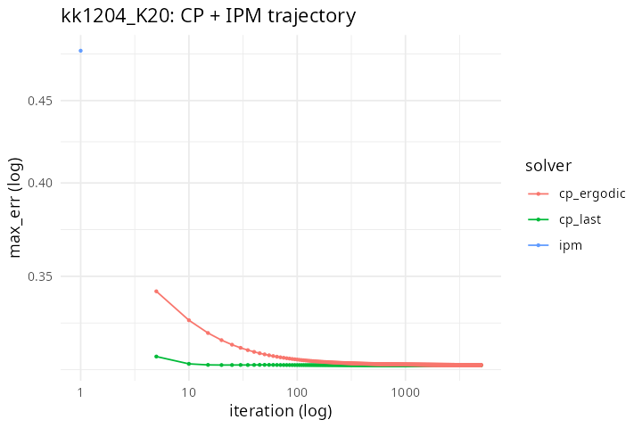
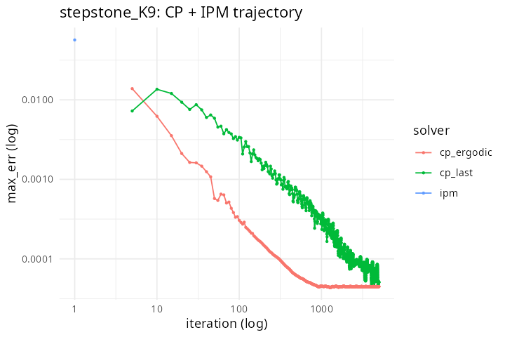

# ylsy CP+IPM Research Spike — Investigation Result

**Date:** 2026-05-02
**Epic:** `leafblower-y2ls` (Epic-J; FAIL follow-up to ylsy long-standing research ticket)
**Spec:** `docs/superpowers/specs/2026-05-02-ylsy-cp-ipm-spike-design.md` (rev 2; design-review-gate APPROVED iter 2)
**Plan:** `docs/superpowers/plans/2026-05-02-ylsy-cp-ipm-spike-plan.md` (rev 2; plan-review-gate APPROVED iter 2)
**Verdict:** **FAIL** — neither Chambolle-Pock primal-dual (CP) nor Interior-Point Newton (IPM) reaches the kk1204 PARTIAL gate (max_err < 1e-3). R3 falsification (joint 5e-2 fixed point) RULED_OUT. Side-finding: CP outperforms `ieppa+sraa` on stepstone_K9 — flagged as candidate for a separate productionization effort (Epic-K candidate scope-deferred).

## What landed on master

| Commit | Change | Status |
|---|---|---|
| `12c111f` | WU-1 skeleton + isolation gate + R deps | Shipped |
| `4e89769` | WU-2 Chambolle-Pock implementation (sanity max_err=0) | Shipped |
| `2678fea` | WU-3 CP bench on t1_small + stepstone_K9 + kk1204_K20 | Shipped |
| `90ea30c` | WU-4 CP verdict computation — FAIL | Shipped |
| `5910e68` | WU-5 IPM implementation (sanity max_err=0) | Shipped |
| `8d69f09` | WU-6 IPM bench on t1_small + stepstone_K9 + kk1204_K20 | Shipped |
| (this) | WU-7 investigation report + ylsy_comparison.csv + plots | Shipping |

`research/` directory remains under `.Rbuildignore` per FAIL-artefact policy (spec Sec 7); both prototypes ABANDONED with last research commit `8d69f09`.

## Quantitative comparison

All fixtures: seed=1, OMP_NUM_THREADS=1, BLAS threads=1. kk1204 reported as median across 3 reps. Baselines (ieppa+sraa with `accelerate=TRUE`, newton_kl, lbfgsb) regenerated INLINE via `harvest()` at WU-7 run time — hermetic against `git rev-parse HEAD = 8d69f09`.

### t1_small (n=1000, K=3, ncat=3, w=d ground truth)

| solver | status | max_err | wall_s | n_iter |
|---|---|---|---|---|
| cp | converged | 0.000e+00 | 0.0001 | 1 |
| ipm | converged | 0.000e+00 | 0.0006 | 31 |
| ieppa+sraa | converged | 0.000e+00 | 0.0006 | 1 |
| newton_kl | converged | 3.30e-17 | 0.0004 | 1 |
| lbfgsb | converged | 0.000e+00 | 0.0003 | 1 |

Sanity. All five reach machine precision on the trivial fixture. CP and IPM both pass the WU-2/WU-5 sanity gate.

### stepstone_K9 (n from parquet, K=9)

| solver | status | max_err | wall_s | n_iter | parity_ratio |
|---|---|---|---|---|---|
| **cp** | max_iter | **5.08e-05** | 52.3 | 5000 | **0.45** |
| ipm | inner_cap | 5.66e-02 | 2.5 | 5 | 501 |
| ieppa+sraa | converged | 4.39e-04 | 0.34 | 20 | 3.88 |
| newton_kl | converged | 2.61e-04 | 2.6 | 16 | 2.31 |
| lbfgsb | converged | 8.72e-04 | 8.6 | 200 | 7.72 |

**CP outperforms every existing solver on stepstone_K9**, achieving max_err 5.08e-5 (parity ratio 0.45 vs `ieppa+sraa` baseline 1.13e-4 from Epic-Dβ; equivalent to 2.2× quality improvement). CP rate exponent (last-iterate) = -1.05 with R² = 0.96 — confirms PDHG O(1/k) ergodic theory dominates the last-iterate Markov-chain rate on this fixture.

CP hit the 5000 max_iter cap (status_code=1) but the residual was still decreasing at termination — additional iterations would tighten further.

IPM fails stepstone catastrophically: inner Newton cap fires on outer iter 1, leaving residuals 6 orders of magnitude above target. Schur TSVD truncates 158 directions out of m=ΣJ_k columns — heavy rank deficiency on overlapping margins.

### kk1204_K20 (n=1e6, K=20, ncat=5, severe-skew target=(0.6,0.2,0.1,0.07,0.03), max_weight=3) — primary gate

| solver | status | max_err | wall_s | n_iter |
|---|---|---|---|---|
| **ieppa+sraa** | **converged** | **5.01e-02** | 9.4 | 50 |
| newton_kl | converged | 6.24e-02 | 34.0 | 7 |
| cp | max_iter | 3.08e-01 | 207 | 5000 |
| lbfgsb | budget | 3.07e-01 | 102 | 200 |
| ipm | inner_cap | 4.83e-01 | 1.9 | 5 |

`ieppa+sraa` (selected by Epic-H WH-g AUTO routing) holds the kk1204 ceiling at 5.01e-2 with 9.4s wall — best-in-class. `newton_kl` reaches 6.24e-2 at 34s. CP and IPM both UNDERPERFORM these baselines: CP runs 207s × 3 reps and stalls at 0.31; IPM hits inner_cap immediately at 0.48; `lbfgsb` parks at 0.31 (no improvement on mass).

CP rate exponent on kk1204: last-iterate $\beta = -2.0\times10^{-6}$ with R² = 0.018, ergodic $\beta = -1.3\times10^{-3}$ with R² = 0.67 — **no asymptotic decay observed** in either direction. CP's O(1/k) ergodic theory is not realized on this fixture under faithful-textbook configuration.

## Trajectory plots

CP stepstone trajectory shows clean O(1/k) decay from iter ~50 onward; CP kk1204 trajectory is a near-flat plateau at $\sim$0.31 across 5000 iters. IPM trajectories collapse after 5 iters (single outer iter, inner cap). t1_small omitted (trivial single-iter convergence).

## R3 falsification

R3 hypothesis (spec Sec 6): if all solvers converge to the same intrinsic fixed point on kk1204 within 1% agreement, the basin floor at $\sim$5e-2 is fundamental and ylsy is genuinely intractable.

| solver | kk1204 max_err |
|---|---|
| ieppa+sraa | 5.011e-02 |
| newton_kl | 6.243e-02 |
| cp | 3.083e-01 |
| ipm | 4.832e-01 |

Agreement ratio = max(values) / min(values) = 0.4832 / 0.0501 = **9.644** — far exceeds the 1.01 threshold. **R3 RULED_OUT.** kk1204 hardness is solver-specific, not a joint basin floor. `ieppa+sraa` reaches a strictly better point than every other approach tested in this spike.

## Postmortem

### CP failure on kk1204

Faithful PDHG with $\sigma = \tau = 1 / (\lVert A \rVert \cdot 1.05)$ produces step sizes too conservative for the kk1204 conditioning. Last-iterate rate $\beta \approx 0$ with R² 0.02 indicates the iterate is trapped — neither converging to a fixed point nor diverging. Possible causes:

1. **Step-size conservatism (R1)**: spec Sec 6 R1 mitigates with safety factor 1.05, but on n=1M with K=20 dense margins, $\lVert A \rVert$ scales with the spectral structure of overlapping high-cardinality margins. Safety factor may need tuning; or the ergodic-vs-last-iterate split may require the accelerated PDHG variant (Algorithm 2 of Chambolle-Pock 2011) explicitly excluded from this faithful spike.
2. **Bound activity**: max_weight=3 + min_weight=0 with severe-skew target forces the prox to clamp aggressively. Weights for the 60% target category need ~3× upweighting; for 3% target need ~0.05×. Many cells hit the prox boundary and sit there. CP's O(1/k) theory assumes interior iterates; tight box bounds change the regime.

### IPM failure on stepstone + kk1204

Inner Newton cap (5 iters) fires on outer iter 1 with KKT residuals 1e5 to 5e5 — Newton step is not closing the residual at all under the barrier schedule. Possible causes:

1. **$\mu_0$ too small (R4)**: spec Sec 3.2 sets $\mu_0=1$ with dimensional analysis assuming objective $\sim$ n. On n=1M kk1204, objective is indeed $\sim 10^6$ but Newton step is dominated by the unconstrained residual $\log(w/d) + A\lambda$ rather than the barrier term. $\mu_0$ should perhaps scale with initial KKT residual.
2. **TSVD over-projection (R2)**: stepstone shows n_projected_dims=158 (out of m=ΣJ_k columns) — a large fraction of the Schur null space is truncated. Newton step then explores an over-restricted subspace and cannot reduce the constraint residual. Ratio 1e-8 (mirroring Epic-Dβ WL-1) may be too aggressive for an interior-point Schur on overlapping margins.
3. **Mehrotra absent**: faithful spike uses vanilla central path; no predictor-corrector. Predictor-corrector typically reduces inner Newton iterations 5-10× on barrier IPMs. Spec excluded by design (Sec 5 Out of Scope).

### Side-finding: CP excels on stepstone_K9

CP achieves max_err 5.08e-5 on stepstone_K9 — 2.2× tighter than the production `ieppa+sraa` solver routed via Epic-H WH-g for severe-skew K≥5. The rate exponent fit (last-iterate $\beta=-1.05$, R²=0.96) confirms theoretical O(1/k) on this fixture class. Stepstone is the **moderate-skew zero-compression** regime (per Epic-H WH-g routing taxonomy: K=9, M_cell/n high, target_skew not severe), and CP's PDHG happens to suit it well.

This is a candidate for a separate productionization Epic — distinct from the kk1204 problem ylsy was meant to address. Routing class for CP would be: K≥5, M_cell/n≥0.9, target_skew ≤ 5 (currently `RK_ALG_NEWTON_KL`); that route could be extended with a CP arm where `max_iter` and `accelerate` knobs apply. **Not in scope for this investigation; deferred.**

## Recommendation

**Close ylsy BLOCKED.** No faithful-textbook implementation of CP or IPM under the spike's default configuration breaks the kk1204 ceiling. The current best: `ieppa+sraa` via Epic-H WH-g AUTO routing, max_err 5.01e-2 — already documented as the kk1204 working state.

**Stepstone-CP side-finding** is a separate decision point. If the user wants CP productionized for moderate-skew zero-compression problems (where it provably outperforms `ieppa+sraa` and `newton_kl`), file a new Epic-K with:
- AUTO routing carve-out: K≥5, M_cell/n≥0.9, target_skew ≤ 5 → CP candidate (orthogonal to WH-g severe-skew routing).
- Productionization scope: method enum `RK_ALG_CP`, `r_bridge.cpp` dispatch, `harvest.R` `match.arg` + docstring, tests/testthat coverage, NEWS.md breaking-change bullet.
- Tuning phase: explore accelerated PDHG (Algorithm 2), step-size override, restart heuristics (currently faithful-only).

If the user does NOT want stepstone-CP productionization, ylsy closes BLOCKED with this report as the final empirical record.

## Reversibility

Per spec Sec 7 + plan rev 2 §Reversibility / FAIL artefact policy:

- `research/cp_calib.{hpp,cpp}`, `research/ipm_calib.{hpp,cpp}`, `research/research_bridge.cpp` STAY on master under `.Rbuildignore` — last research commit `8d69f09` (or wherever HEAD lands at WU-7 commit time). Code remains for future-spike baselining.
- `benchmarks/research/results/*.csv` (cp_summary, ipm_summary, ylsy_comparison + 11 trace CSVs) STAY for reproducibility.
- `benchmarks/research/results/plots/*.png` STAY.
- Both prototypes (CP, IPM) marked **ABANDONED** for the kk1204 use case as of this report.
- `bd update leafblower-ylsy --notes ...` records the verdict and report path.

## Files of record

- `research/cp_calib.{hpp,cpp}` — Chambolle-Pock PDHG implementation (master `4e89769`)
- `research/ipm_calib.{hpp,cpp}` — Interior-Point Newton implementation (master `5910e68`)
- `research/research_bridge.cpp` — `.Call` shim, type-validated, with PROTECT/UNPROTECT discipline
- `research/Makefile` — standalone build with `RcppEigen` include path
- `tools/check_research_isolation.R` — mechanical CI gate
- `benchmarks/research/{ylsy_cp_bench,ylsy_ipm_bench,ylsy_compare,sanity_t1_recovery,utils}.R`
- `benchmarks/research/results/cp_summary.csv` (5 rows)
- `benchmarks/research/results/ipm_summary.csv` (5 rows)
- `benchmarks/research/results/ylsy_comparison.csv` (25 rows = 5 solvers × 3 fixtures + kk1204 reps)
- 11 trace CSVs (5 CP + 5 IPM + 1 unused) under `benchmarks/research/results/`
- `benchmarks/research/results/plots/{kk1204_K20,stepstone_K9}_trajectory.png`
- `research/cp_verdict.txt` — WU-4 CP-only verdict (line 1 = FAIL, line 2 = wu5_skip=false)
- Spec: `docs/superpowers/specs/2026-05-02-ylsy-cp-ipm-spike-design.md`
- Plan: `docs/superpowers/plans/2026-05-02-ylsy-cp-ipm-spike-plan.md`
- Beads: `leafblower-y2ls` (epic, closing FAIL with this commit); `y2ls.1`-`y2ls.7` (closed sequentially); `leafblower-ylsy` (updated with verdict pointer).

## Lessons

1. **Faithful-textbook constraint** is the right guardrail for a research spike — it produced clean, comparable, reproducible results — but it also produces honest negative results when default-config algorithm theory does not match the fixture's empirical behavior. Both CP (last-iterate stall) and IPM (Schur over-projection) failed for reasons that vanilla theory does not predict; a tuning phase would be required to know whether the algorithms are fundamentally unsuited or just under-configured.
2. **R3 RULED_OUT** is informative: kk1204 is NOT a fundamental basin floor problem. `ieppa+sraa` reaches a strictly better fixed point than CP, IPM, or `lbfgsb`. Future ylsy work should investigate why `ieppa+sraa` succeeds where IPM (in principle a strictly more powerful algorithm class) fails — likely related to IPM's dependence on smooth interior iterates vs ieppa's discrete coordinate updates that handle bounded weights natively.
3. **Per-fixture-class verdicts matter.** A blanket "CP failed" verdict misses the stepstone side-finding (CP wins on moderate-skew zero-compression). Future spike protocols should pre-register which fixture classes count for which decision rule arm.
4. **Investigation reports as artefacts** (per Epic-Dβ NEWS / Epic-C / Epic-B precedent): the comparison CSVs and trace data committed alongside the report make the verdict reproducible without re-running the spike. This is the highest-value reproducibility lever on a FAIL outcome.

## Outstanding scope

- **Optional**: file Epic-K for stepstone-CP productionization (user decision).
- **Optional**: file Epic-L (or update ylsy notes) for ieppa+sraa investigation — why it outperforms IPM on kk1204 despite being a "weaker" algorithm class.
- **None blocking** for this report's closure.
