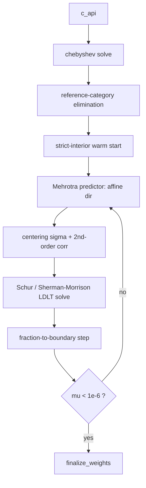

# CHEBYSHEV — Mehrotra Interior-Point Method on the Minimax Calibration LP

> Enum: `RK_ALG_CHEBYSHEV = 5`
> Source: `src/chebyshev.cpp`, `src/chebyshev.hpp`

## Overview

The only **interior-point / linear-programming** solver in the suite. Instead of minimising a divergence, it minimises the **worst-case (Chebyshev / L∞) marginal error**: make the *largest* relative margin deviation as small as possible, subject to the cell-mass box. It is solved with **Mehrotra's predictor–corrector** primal-dual interior-point algorithm with second-order centring correction.

To break the normalisation degeneracy (margins within one variable are linearly dependent), it uses **reference-category elimination** — drop the first category per multi-category margin from the LP variables.

## Mathematical formulation

### Objective — minimax LP

```
min_{X, δ}   δ
s.t.   | S[m]/W − T[m] | ≤ δ / w_kj[m]      for every margin component m
       L_c ≤ X[c] ≤ U_c                      (cell box)
```

where `S[m] = Σ_{c∈m} X[c]`, `w_kj[m]` is the per-component weight, and `δ` is the Chebyshev radius being minimised. This is a linear program; the optimum equalises the weighted margin errors at the minimax value.

### Interior-point step (verified, `chebyshev.cpp`)

Mehrotra primal-dual with slacks `s_lo, s_hi, s_up, s_dn, s_delta` and dual `y_*`:

```
μ      = comp / n_comp,    comp = y_delta·s_delta + Σ y·s     (complementarity)
σ      = clamp( (μ_aff/μ)^3 , 1e-8, 1 )                       (centring parameter)
corr   = −Δs_aff · Δy_aff                                     (2nd-order Mehrotra term)
solve  reduced normal equations (Schur complement, Sherman–Morrison, Jacobi-preconditioned LDLᵀ)
X += α_p·dX ;  δ += α_p·dδ ;  y += α_d·dy                     (fraction-to-boundary steps)
```

The `corr = −Δs_aff·Δy_aff` term is the genuine Mehrotra cross-term — **do not "fix" it** (see `CLAUDE.md`). A dual-explosion guard reverts to a scaled unit diagonal if `μ_new > 100·μ`.

## Architecture



- **Warm start**: strictly interior; optional mass-preserving clamp of ORIS cell masses.
- **Linear algebra**: reduced normal equations via Schur complement + Sherman–Morrison rank-1 + Jacobi-preconditioned LDLᵀ.
- **Best-iterate** tracked by actual calibration error `errRp`, not LP `δ` (δ can hit its floor while the primal is still off — source comment).
- **Hard cap** `kMaxIpm = 500`; objective via `select_solver_objective → m.errRp`.

## Advantages

- **Minimax optimality**: directly minimises the *worst* margin error — the right objective when you care about the largest discrepancy, not average fit.
- **Polynomial-time, quadratically-convergent** near the optimum (interior-point theory).
- Mehrotra predictor–corrector is the production standard for LP — far fewer iterations than first-order methods.
- Handles the box constraints natively as LP inequalities.

## Drawbacks

- **Heaviest per-iteration cost**: forms and factorises a (reduced) normal-equation system each step.
- **Numerically delicate** on `K ≥ 9` overlapping margins — "Mehrotra needs LP stability"; hard-capped at 500 iters because some systems never converge (source comment).
- Minimax (L∞) ignores the design weights → can produce a less smooth weight distribution than KL methods (no closeness-to-design term in the objective).
- Most complex code path; degeneracy handling (reference elimination, dual-explosion guard) is intricate.

## Mathematical guarantees and proofs

| Claim | Status | Basis |
|-------|--------|-------|
| LP has the stated minimax optimum | **Strong** | Standard LP duality; the formulation is an exact minimax LP. |
| Mehrotra IPM converges (super-linearly/quadratically) for well-posed LP | **Strong** | Mehrotra (1992); Wright, *Primal-Dual Interior-Point Methods*. |
| Convergence on this calibration LP for all inputs | **Weak** | Explicitly **not** guaranteed: hard-capped at 500 iters; K≥9 overlapping margins "don't converge regardless of budget" (source comment). |
| 2nd-order correction term correctness | **Strong** | Verified correct in-repo (the −Δs_aff·Δy_aff cross-term); guarded against erroneous "fixes". |
| Bracket/guard against dual explosion | **Moderate** | Heuristic revert (`μ_new > 100·μ`) — engineering safeguard, not a proof. |

**Appraisal: Strong in theory, Moderate in practice.** The minimax LP and Mehrotra's method are rigorously proven, but the source itself documents non-convergence on dense overlapping-margin systems — a real external-validity limit, not a theoretical one.

## Code references

| Component | File | Key symbols |
|-----------|------|-------------|
| IPM loop | `src/chebyshev.cpp` | `mu`, `sigma`, `s_delta`, `y_delta`, `delta` |
| 2nd-order corr | `src/chebyshev.cpp` | `corr = −Δs_aff·Δy_aff` (Mehrotra block) |
| Degeneracy fix | `src/chebyshev.cpp` | reference-category elimination |
| Convergence test | `src/chebyshev.cpp` | `kTolMu = 1e-6`, `kPrimalMachinePrecConv` |
| Objective select | `src/calib_dispatch.hpp` | `select_solver_objective` → `m.errRp` |

---

## History & seminal sources

Mehrotra's predictor–corrector method was introduced in 1989 (circulated as a technical report) and published in 1992 as [mehrotra1992]. It belongs to the primal–dual interior-point family that emerged after Karmarkar's 1984 polynomial-time projective algorithm reignited interest in interior-point methods for LP. The predictor–corrector variant is a second-order Newton method on the perturbed KKT system: a pure affine-scaling (predictor) step is computed first at σ = 0, then a centering/correction (corrector) step uses the affine step length α_aff to adaptively set σ = (μ_aff/μ)³ and adds a second-order Taylor correction −Δs_aff·Δy_aff to the complementarity residual. The combined step achieves superlinear (often near-quadratic) local convergence on non-degenerate problems while requiring only one Cholesky factorization per iteration (the corrector reuses the predictor's factors).

Among the earliest production implementations were Lustig, Marsten, and Shanno (OB1 solver, 1989–1994), who demonstrated the framework achieved ~40% fewer iterations and ~2× wall-clock speed-up over first-order path-following methods on Netlib benchmark problems. The broader theoretical treatment — path-following algorithms, potential-reduction methods, infeasible-interior-point variants, superlinear convergence theory, and extensions to semidefinite and monotone complementarity problems — is consolidated in [wright1997primaldual]. Chapter 16 of [nocedalwright2006] describes Mehrotra's algorithm as "the basis of much of the current generation of LP software" and provides a convergence analysis of the long-step path-following precursor.

The LP reformulation of minimax (L∞) problems — introducing a scalar slack δ so that max_m |error_m| ≤ δ becomes a linear constraint — is classical Chebyshev approximation theory, traceable to Chebyshev (1853) via the equioscillation theorem. Its use as a *survey calibration* objective is a recent development; it appears as a component of soft / stable-balancing-weights frameworks, primarily through the optweight R package (Greifer, SBW method of [zubizarreta2015]) and the literature on high-dimensional survey calibration.

---

## Practitioner implementations & use cases

The Mehrotra predictor–corrector algorithm is the interior-point engine in virtually every major LP solver:

- **HiGHS** [huangfuhall2018] — open-source (MIT), C++, sparse LP/MIP/QP. HiGHS originally shipped IPX (iterative Krylov/PCG IPM for dense-column robustness) as its interior-point component; a direct-factorization regularised IPM (HiPO, Zanetti & Gondzio 2025) was added more recently. Primary use cases: large-scale energy-systems modelling (GenX, PyPSA), general-purpose sparse LP.

- **MOSEK** — commercial; specialises in semidefinite, second-order-cone, and quadratically constrained programming. Interior-point kernel is a Mehrotra-style predictor–corrector on the homogeneous self-dual model.

- **Gurobi / CPLEX** — commercial; both expose a "Barrier" method that is a Mehrotra predictor–corrector variant, used alongside dual simplex for large-scale LP/MIP in logistics, finance, and energy.

- **Clarabel** [goulartchen2026] — open-source (Rust + Julia/Python/R interfaces); uses a homogeneous self-dual embedding to handle quadratic objectives directly without epigraphical lifting. For LP it executes Mehrotra predictor–corrector on the normal equations with sparse Cholesky. The R package `optweight` calls Clarabel (or OSQP) to solve the stable-balancing-weights problem including the L∞ minimax norm.

- **GLPK / CLP** — legacy open-source simplex-first solvers; both include an IPM but are substantially slower (CLP ~2.5×, GLPK ~58× vs. Gurobi on typical benchmarks). Use cases: academic baseline, lightweight embedded scenarios.

L∞ minimax calibration as a *survey weighting* application is comparatively uncommon in deployed production software. Traditional Deville–Särndal calibration (GREG / L₂ chi-squared distance, [devillesarndal1992]) and raking (relative entropy / logit) dominate practitioner toolkits (SAS CALMAR, R `survey`/`ReGenesees`). The optweight package is the primary open-source tool supporting the minimax norm explicitly; it delegates to an off-the-shelf conic solver.

---

## Known caveats & concerns (literature)

The following limitations are documented across [mehrotra1992], [wright1997primaldual], [nocedalwright2006], and the HiGHS/Clarabel literature:

1. **Asymptotic ill-conditioning.** As μ → 0 the scaling matrix Θ = XS⁻¹ has entries diverging to 0 or ∞ (primal and dual variables separate toward the complementary partition). The condition number of the normal equations AΘAᵀ grows as O(μ⁻²). Standard 64-bit arithmetic limits practical termination tolerances to ~10⁻⁸; tighter tolerances require extended precision or regularisation. Nocedal & Wright (§14.2) note that most production codes stop at 10⁻⁸ for this reason.

2. **Degeneracy / strict feasibility failure.** When strict complementarity does not hold at the solution (degenerate optimal face), the Jacobian of the KKT conditions is singular at the optimum. The algorithm loses superlinear convergence and falls back to linear convergence, yielding lower-accuracy solutions. For LP calibration with overlapping multi-category margins (K ≥ 9 in leafblower's experience) this is the dominant failure mode.

3. **Dense normal-equation fill-in.** A single dense column in A makes AΘAᵀ fully dense, causing O(m³) factorization cost. Production solvers handle this via Sherman–Morrison–Woodbury updates to isolate dense columns (see Wright Ch. 11, Nocedal & Wright §16.7). The leafblower implementation uses this approach: one Sherman–Morrison rank-1 update for the δ variable plus a Schur complement for the ν variable.

4. **Scaling sensitivity.** Without prior row/column equilibration (e.g., Ruiz scaling or MC64 matching permutations), poorly scaled constraint data produces near-singular normal equations regardless of algorithm correctness. First-order methods (PDHG, cuPDLP) are more sensitive; direct-factorization IPMs tolerate moderate ill-conditioning but not extreme magnitude differences.

5. **No graceful divergence on infeasible/unbounded inputs.** The standard predictor–corrector diverges (infeasibility residuals blow up) when presented with an infeasible LP; crossover from an interior-point solution to an exact vertex can fail under high degeneracy.

6. **Crossover cost.** IPM converges to a dense interior-point solution; computing an exact basic feasible solution (vertex) requires a crossover phase that can be as expensive as the IPM itself under degeneracy. leafblower omits crossover — it uses the interior-point cell masses directly, which is appropriate for calibration (a continuous weight problem) but not for strict LP optimality certification.

---

## How leafblower deviates

leafblower implements a **bespoke** Mehrotra predictor–corrector rather than calling an off-the-shelf LP solver (HiGHS, MOSEK, Clarabel). The specific departures from textbook Mehrotra and from black-box solver practice are:

**Structural exploits (better than generic):**
- The constraint matrix A is a 0/1 cell-margin incidence matrix (each cell belongs to exactly one category per margin). This produces an especially sparse AΘAᵀ (at most K non-zero off-diagonal blocks) and makes the Schur complement for the total-weight equality (ν variable) cheap: Schur denominator = D_ν − eᵀN⁻¹e, computed in O(K·M_cell) rather than O(m³).
- The δ variable (LP slack for minimax objective) participates via a rank-1 Sherman–Morrison update, adding only O(m) per solve. Generic solvers would treat δ as an ordinary variable with no special treatment.
- Reference-category elimination drops one constraint per multi-category margin, reducing the normal-equation dimension from K·(C_max) to K·(C_max − 1) and removing the exact singularity from normalization constraints.
- No crossover required: calibration weights are continuous masses; the interior-point solution is the deliverable.

**Engineering departures (compared to production solvers):**
- **No Ruiz/MC64 pre-scaling.** leafblower relies on the structural regularity of the cell-mass problem (all Tgt entries are O(n), w_kj = n) to maintain conditioning. Generic solvers apply 5–10 rounds of equilibration unconditionally.
- **Hard iteration cap at 500.** Production solvers do not hard-cap; they vary the strategy (increase regularisation, switch to simplex) when IPM stalls. leafblower logs NOCONV and returns best-iterate.
- **Best-iterate tracking by calibration error errRp, not by LP objective δ.** This is correct for the calibration use case (δ can stagnate while primal quality is still improving) but departs from LP-optimality bookkeeping.
- **No homogeneous self-dual embedding.** leafblower uses a strictly feasible warm-start (shifted off bounds by kWarmStartRelEps) rather than a self-dual embedding, so infeasible inputs diverge instead of being certified infeasible. For a calibration solver this is acceptable — infeasibility is caught upstream by `solver_setup_ct`.
- **μ explosion guard** (`μ_new > 100·μ` → revert): engineering heuristic not present in the Mehrotra (1992) paper or Wright (1997); prevents dual blow-up on ill-conditioned systems.

**Comparison verdict:** The bespoke approach is superior in per-iteration cost for the specific cell-margin LP structure (fewer FLOPs, no redundant generality). It is inferior to production solvers in robustness: no scaling, no infeasibility certification, no adaptive strategy change on stall. For K ≤ 8 well-separated margins this cost/robustness trade-off is favourable; for K ≥ 9 overlapping margins the stall issue is unsolved in either approach without structural improvements to the LP formulation.

---

## References

[devillesarndal1992] Deville, J.-C. and Särndal, C.-E. (1992). Calibration estimators in survey sampling. *Journal of the American Statistical Association*, 87(418), 376–382. doi:10.2307/2290268


[goulartchen2026] Goulart, P. J. and Chen, Y. (2026). Clarabel: An interior-point solver for conic programs with quadratic objectives. *Mathematical Programming Computation*. doi:10.1007/s12532-026-00320-7. URL: https://arxiv.org/abs/2301.01312

[huangfuhall2018] Huangfu, Q. and Hall, J. A. J. (2018). Parallelizing the dual revised simplex method. *Mathematical Programming Computation*, 10(1), 119–142. doi:10.1007/s12532-017-0130-5. URL: https://highs.dev/

[mehrotra1992] Mehrotra, S. (1992). On the implementation of a primal-dual interior point method. *SIAM Journal on Optimization*, 2(4), 575–601. doi:10.1137/0802028. URL: https://epubs.siam.org/doi/10.1137/0802028

[nocedalwright2006] Nocedal, J. and Wright, S. J. (2006). *Numerical Optimization* (2nd ed.). Springer. doi:10.1007/978-0-387-40065-5. ISBN: 978-0-387-30303-1

[wright1997primaldual] Wright, S. J. (1997). *Primal-Dual Interior-Point Methods*. SIAM. doi:10.1137/1.9781611971453. ISBN: 978-0-89871-382-4

[zubizarreta2015] Zubizarreta, J. R. (2015). Stable weights that balance covariates for estimation with incomplete outcome data. *Journal of the American Statistical Association*, 110(511), 910–922. doi:10.1080/01621459.2015.1023805
