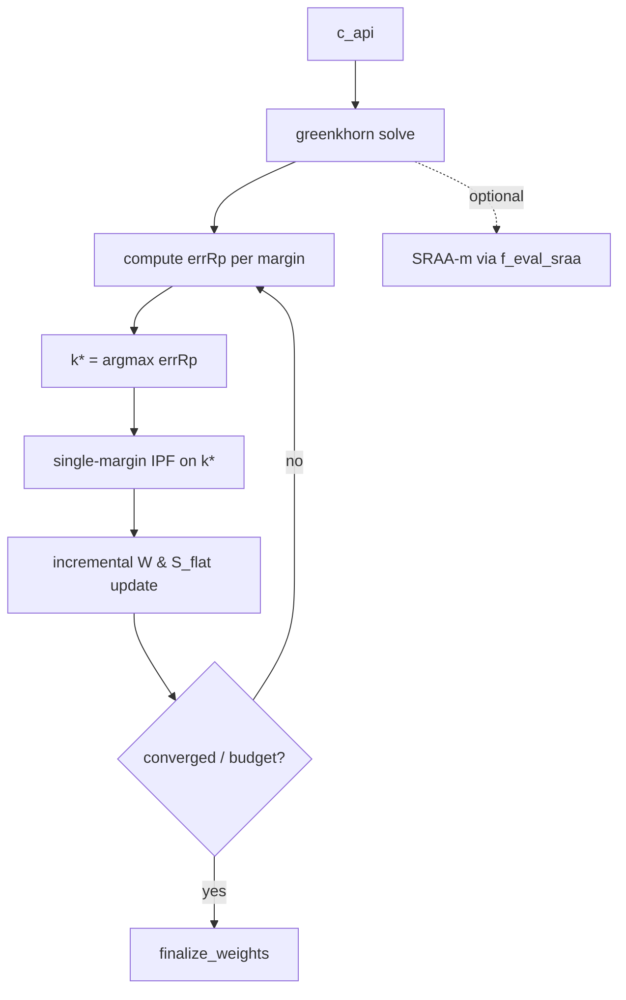

# GREENKHORN — Greedy Coordinate-Descent IPF

> Enum: `RK_ALG_GREENKHORN = 9`
> Source: `src/greenkhorn.cpp`, `src/greenkhorn.hpp`

## Overview

A **greedy coordinate-descent variant of IPF/Sinkhorn**: instead of sweeping every margin each iteration, each step updates **only the single margin with the largest current calibration residual** (`argmax_k errRp[k]`), then incrementally maintains the affected bucket sums. This is the Greenkhorn algorithm (Altschuler–Weed–Rigollet 2017), here in the project's "autumn::harvest" style. Because the greedy choice is deterministic (same `X` ⇒ same argmax), the map is stationary and SRAA-m can accelerate it.

Crucially, Greenkhorn **does not minimise KL directly** — it drives down the max marginal residual `errRp` (source comment: `best_objective` stays ∞ for greenkhorn).

## Mathematical formulation

### What it optimises

Greedy reduction of the maximum marginal violation:

```
errRp[k] = Σ_j | S_kj / W − T_kj |        (per-margin residual)
k* = argmax_k errRp[k]                      (greedy pick each step)
```

It targets feasibility (all margins satisfied) rather than an explicit KL/χ² objective; at a feasible fixed point it coincides with the IPF solution.

### Update rule (verified, `greenkhorn.cpp`)

For the chosen margin `k*`, do a full single-margin IPF rescale with incremental bookkeeping:

```
for each category j in k*:
    f = T_{k*,j} · W / S_flat[k*,j]
    for each cell c in (k*, j):
        X_new = clamp( X[c]·f, L_c, U_c )
        delta = X_new − X[c]
        X[c]  = X_new
        W    += delta                          # incremental total mass
        for each other margin k2 ≠ k*:
            S_flat[k2, g2(c)] += delta          # incremental bucket update
```

Then recompute `errRp[k]` for all margins and pick the next `k*`.

## Architecture



- **Greedy selection** drives each step; incremental `S_flat` / `W` updates avoid full re-sums.
- **Two best-iterate trackers**: `sraa_best` on the cheap `errRp` scale (drives SRAA outer-stall revert) vs. the reported `best` on the configured metric — kept distinct to avoid the recurring SRAA best-iterate bug noted in `CLAUDE.md`.
- **Stall classification**: stall_kind = 2 (KL plateau, Sinkhorn-class) on `RK_ERR_STALL`.
- **Finalize**: shared `finalize_weights`.

## Advantages

- **Cheap per-step**: touches one margin's cells + incremental bucket maintenance — much less work per *step* than a full sweep when one margin dominates the error.
- **Theoretically better worst-case complexity** than Sinkhorn for the OT scaling problem (Altschuler–Weed–Rigollet): `Õ(n/ε²)` vs `Õ(n²/ε²)`-type bounds.
- Deterministic greedy → stationary map → SRAA-m compatible.
- Hard bounds clamped inline each step (always box-feasible).

## Drawbacks

- **Does not minimise KL directly** — best-iterate on a KL/χ² metric is awkward (`best_objective = ∞`); the natural objective is max-residual.
- Greedy pick can ping-pong between two near-tied margins, wasting steps (oscillation monitored, not eliminated).
- `errRp` recomputation across all margins each step partly offsets the per-step saving.
- First-order; no second-order curvature use.

## Mathematical guarantees and proofs

| Claim | Status | Basis |
|-------|--------|-------|
| Converges to the marginal-feasible (IPF) solution | **Strong** | Greenkhorn convergence — Altschuler, Weed, Rigollet (NeurIPS 2017): greedy Sinkhorn converges, with explicit iteration complexity. |
| Improved Õ(n/ε²) complexity vs Sinkhorn | **Moderate** | Proven for the entropic-OT setting in the cited paper; this implementation matches the algorithm but the bound is not re-derived for the calibration variant. |
| Box-feasibility of every iterate | **Strong** | `clamp(·,L,U)` each step. |
| Best-iterate selection correctness | **Moderate** | Guarded by separate `errRp`-scale vs metric-scale trackers (regression-tested; bug re-introduced twice per `CLAUDE.md`). |

**Appraisal: Moderate→Strong.** Convergence and the complexity advantage are backed by a peer-reviewed proof for the OT scaling problem. The repo's bounded/calibration adaptation is faithful but the complexity bound is inherited, not re-proved.

## Code references

| Component | File | Key symbols |
|-----------|------|-------------|
| Greedy pick + step | `src/greenkhorn.cpp` | `errRp`, `compute_errRp_k`, `k_step`, `S_flat`, `delta`, `W +=` |
| Best-iterate trackers | `src/greenkhorn.cpp` | `sraa_best`, `best`, `first_errRp` |
| No direct KL note | `src/greenkhorn.cpp` | "greenkhorn does not minimise KL directly" |
| Acceleration | `src/sraa.hpp` | SRAA-m via `f_eval_sraa` |
| Finalize | `src/calib_dispatch.hpp` | `finalize_weights` |

---

## History & seminal sources

The algorithm's lineage runs through three papers.

**Sinkhorn (1967)** [sinkhorn1967diagonal] established the diagonal scaling theorem: any strictly positive matrix can be uniquely scaled to prescribed row and column sums via alternating row/column rescalings. This is the theoretical foundation for IPF/raking.

**Cuturi (2013)** [cuturi2013sinkhorn] popularised entropic regularisation for optimal transport, showing that the Sinkhorn/IPF iteration solves the smoothed transport LP in near-linear time relative to matrix sparsity, making it tractable for machine-learning applications. This paper is why the OT community rediscovered the 1967 result.

**Altschuler, Weed & Rigollet (2017)** [altschuler2017greenkhorn] introduced Greenkhorn at NeurIPS 2017 as a spotlight paper. The key contribution is the greedy selection rule: instead of cycling over all margins, select the single margin `argmax_k errRp[k]` (via KL projection divergence) and update only that margin's cells. Motivation was sparse image data where only a small fraction of pixels carry non-negligible mass — Sinkhorn wastes O(n) work on near-zero rows while Greenkhorn skips them. Proven complexity (both algorithms): `Õ(n²‖C‖³_∞/ε³)` in the original paper.

**Lin, Ho & Jordan (2019)** [linhojordan2019] (ICML, PMLR 97, pp. 3982–3991) closed the theoretical gap left by Dvurechensky et al. 2018, who had improved Sinkhorn to `Õ(n²‖C‖²_∞/ε²)` via a "shift property" that Greenkhorn lacks (single-coordinate updates break the global conservation). Lin et al. developed a primal-dual framework proving Greenkhorn achieves the same `Õ(n²‖C‖²_∞/ε²)` bound, matching Sinkhorn asymptotically.

**Luo, Yang & Wei (2023)** [luoyang2023improved] (arXiv 2305.14939) proved that vanilla Greenkhorn (without marginal perturbation/lifting) natively achieves `O(n²‖C‖²_∞ log n/ε²)` via a discrete equicontinuity property, matching the vanilla Sinkhorn bound without requiring artificial smoothing of the target marginals.

---

## Practitioner implementations & use cases

**Python Optimal Transport (POT)** [flamary2021pot] is the primary open-source vehicle. Greenkhorn is available as `ot.bregman.greenkhorn` or `ot.sinkhorn(..., method='greenkhorn')`, documented from at least POT 0.9.6 (JMLR 2021). POT also appeared in GPU benchmarking papers (cuRegOT, 2025) as the reference CPU baseline for Greenkhorn.

**Multimarginal extension.** Kostic, Salzo & Pontil (ICML 2022) [kostic2022batch] proposed a batch variant for multimarginal OT, proving linear convergence rate with explicit iteration complexity — extending the two-marginal greedy idea to K > 2 marginals.

**Domain applications** in the OT literature: image comparison (the original motivating use case, Earth Mover's Distance on MNIST); point cloud registration; domain adaptation; origin-destination matrix estimation (transport planning). Survey calibration and statistical raking are **not represented** in the literature as application domains for Greenkhorn — see § How leafblower deviates.

---

## Known caveats & concerns (literature)

1. **GPU-hostile.** Sinkhorn's block updates map to BLAS dense matrix-vector multiplications that saturate GPU pipelines. Greenkhorn's argmax scan across 2K elements at every step is inherently sequential, introduces thread synchronisation overhead, and produces extremely low arithmetic intensity. POT documentation explicitly recommends Greenkhorn only for CPU, small-to-moderate n (n, m < 10³); for n > 10⁴ Sinkhorn on GPU (CuPy/JAX) dominates [linhojordan2019; flamary2021pot].

2. **Per-step recomputation overhead.** The argmax scan costs O(K) per step. In the calibration setting K is small (2–20 margins), so this is minor, but for large K the scan can negate the gain from touching a single margin's cells.

3. **No direct KL minimisation.** Sinkhorn minimises the entropic transport objective monotonically per full sweep; Greenkhorn has no monotone potential. The natural convergence criterion is `max_k errRp[k]`, not KL or χ². Reporting KL/χ² requires tracking a separate best-iterate on the configured metric (see CXX.2 in `greenkhorn.cpp`).

4. **Ping-pong between near-tied margins.** When two margins have nearly equal residual, the greedy rule can alternate between them without making net progress. This is stall_kind = 2 (KL plateau, Sinkhorn-class) in leafblower; the SRAA-m outer-stall revert partially mitigates it.

5. **Theoretical bound vs. wall-clock.** The `Õ(n/ε²)` vs `Õ(n²/ε²)` comparison in [altschuler2017greenkhorn] is per-*arithmetic-operation*, not per-wall-clock-second. On dense, balanced data (all margins equally violated, uniform mass) the greedy advantage shrinks because the saved rows/columns are few and the argmax scan is non-trivial overhead. Empirical advantage is consistently observed on *sparse* distributions; it is not guaranteed on uniform-mass calibration populations.

---

## How leafblower deviates

Leafblower applies Greenkhorn to the survey calibration / raking problem — **not** the entropic OT problem. Key structural differences:

| Axis | OT literature | Leafblower |
|------|--------------|-----------|
| Variables | Transport matrix P ∈ ℝ^{n×n} | Cell weight vector X ∈ ℝ^M, M = product of category counts |
| Marginals | Two (row r, col c) | K ≥ 1 arbitrary margins |
| Regulariser | Entropic (λ·H(P)) | None — pure IPF / raking |
| Hard bounds | Typically unconstrained | Per-cell box `[L_cell, U_cell]` from `bounds_mode` |
| Argmax | KL projection divergence between scaled rows/cols | `max_k max_j |S_kj/W − target_kj|` (max marginal residual `errRp[k]`) |
| Convergence criterion | Transport polytope distance | `tol_abs` on max-residual or configured metric |

The greedy argmax metric in leafblower is `errRp` (max absolute share deviation) rather than KL projection divergence. This is simpler and avoids computing logarithms per candidate margin; it is appropriate because the calibration problem has no entropic regulariser and the natural convergence metric is max-residual.

The theoretical complexity guarantee from [altschuler2017greenkhorn] and [linhojordan2019] applies to the entropic-OT formulation. The bound is cited here as inherited motivation, **not re-proved** for the calibration variant. Convergence for the pure IPF case (no regulariser) is separately covered by the classical Sinkhorn/IPF convergence literature; Greenkhorn inherits it via the greedy-is-at-least-as-good argument, but no published paper states this for the K-margin, bounded-weight calibration setting. This is a known open gap.

---

## References

[altschuler2017greenkhorn] Altschuler, J., Weed, J., & Rigollet, P. (2017). Near-linear time approximation algorithms for optimal transport via Sinkhorn iteration. *Advances in Neural Information Processing Systems 30 (NIPS 2017)*, 1961–1971. https://arxiv.org/abs/1705.09634

[sinkhorn1967diagonal] Sinkhorn, R. (1967). Diagonal equivalence to matrices with prescribed row and column sums. *The American Mathematical Monthly*, 74(4), 402–405. https://doi.org/10.2307/2314570

[cuturi2013sinkhorn] Cuturi, M. (2013). Sinkhorn distances: Lightspeed computation of optimal transport. *Advances in Neural Information Processing Systems 26 (NIPS 2013)*, 2292–2300. http://papers.neurips.cc/paper/4927-sinkhorn-distances-lightspeed-computation-of-optimal-transport.pdf

[linhojordan2019] Lin, T., Ho, N., & Jordan, M. I. (2019). On efficient optimal transport: An analysis of greedy and accelerated mirror descent algorithms. *Proceedings of the 36th International Conference on Machine Learning (ICML)*, PMLR 97, 3982–3991. https://proceedings.mlr.press/v97/lin19a.html

[luoyang2023improved] Luo, J., Yang, D., & Wei, K. (2023). Improved complexity analysis of the Sinkhorn and Greenkhorn algorithms for optimal transport. arXiv:2305.14939 [math.OC]. https://doi.org/10.48550/arXiv.2305.14939

[flamary2021pot] Flamary, R., Courty, N., Gramfort, A., et al. (2021). POT: Python Optimal Transport. *Journal of Machine Learning Research*, 22(78), 1–8. https://jmlr.org/papers/v22/20-451.html

[kostic2022batch] Kostic, V. R., Salzo, S., & Pontil, M. (2022). Batch Greenkhorn algorithm for entropic-regularized multimarginal optimal transport: Linear rate of convergence and iteration complexity. *Proceedings of the 39th International Conference on Machine Learning (ICML)*, PMLR 162, 11529–11558. https://proceedings.mlr.press/v162/kostic22a.html
