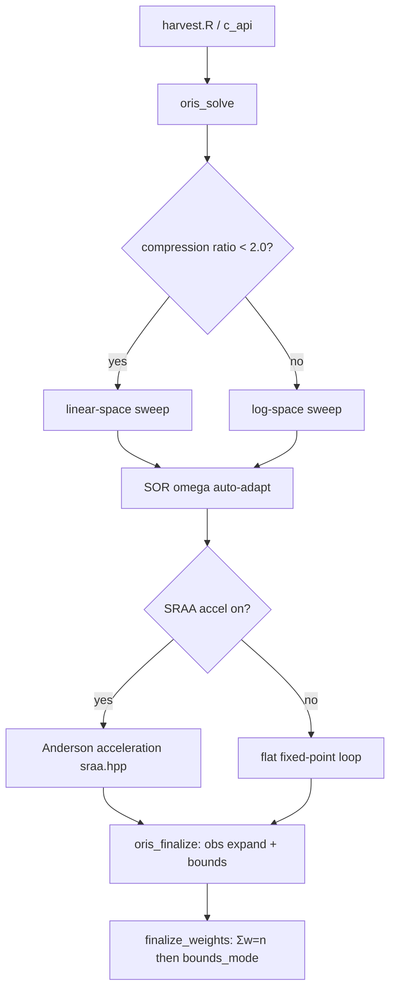

# ORIS — Over-Relaxed Iterative Scaling

> Enum: `RK_ALG_ORIS = 1` (+ variant `RK_ALG_ORIS_SOFT = 8`)
> Source: `src/oris.cpp`, `src/oris_internal.hpp`, `src/oris_finalize.cpp`, `src/oris_trajectory.cpp`

## Overview

ORIS is **iterative proportional fitting (IPF / RAS / Sinkhorn–Knopp) on log-Sinkhorn factors, with successive over-relaxation (SOR) stepping and an infeasibility damping factor**. It is the project's default solver. It adjusts cell masses `X[c]` so every marginal sum matches its target while staying as close as possible (in Kullback–Leibler divergence) to the design weights `X_init`.

The solver keeps one multiplicative factor per `(margin k, category j)` — the Sinkhorn dual scaling — and sweeps the margins repeatedly. It runs in **linear space** when the compression ratio is small and switches to **log space** to avoid overflow when factors grow extreme (cutoff `kLinearSpaceThreshold = 2.0`).

## Mathematical formulation

### Objective

Minimise the I-divergence (generalized KL) of the calibrated masses from the design masses subject to all marginal constraints:

```
min_X   Σ_c X[c] · log( X[c] / X_init[c] ) − X[c] + X_init[c]
s.t.    Σ_{c ∈ (k,j)} X[c] = T_kj    for every margin k, category j
```

This is the standard raking / maximum-entropy calibration problem. Its dual has one Lagrange multiplier per category; the multiplicative factor is `f_kj = exp(λ_kj)`.

### Update rule (verified in `oris_solve`)

Per category, the *naïve* full Sinkhorn ratio is the target over the current marginal sum:

```
naive = T_kj · W_input / S_kj          where S_kj = Σ_{c∈(k,j)} X_cur[c] / f_old
```

The applied step is a power step in linear space, equivalently a fractional step in log space:

```
linear:  f_new = f_old^(1−α·ω) · naive^(α·ω)
log:     lf_new = (1−α·ω)·lf_old + α·ω·(log T_kj·W − log S_kj)
```

- `ω` (`eff_omega`) is the SOR relaxation parameter; `ω = 1` recovers plain IPF (fast path, no `pow()`). Over-relaxation is **opt-in** via `sor = list(auto = TRUE)` — the bare `harvest(method = "oris")` call runs plain IPF (`ω = 1`). When enabled, `ω` is chosen by one of three strategies (`sor = list(omega_mode_id = ...)`), all confined to the globally convergent window `ω ∈ (0, 2)` [thibault2021overrelaxed]:

  | `omega_mode_id` | Strategy | ω rule | Ceiling |
  |---|---|---|---|
  | `0` heuristic | per-margin nudge | grow ×1.05 on errRp decrease, damp ×0.7 on sign-flip | `omega_max` (1.5) |
  | `1` fixed | per-margin jump | snap to `omega_max` while errRp decreases | `omega_max` (1.5) |
  | `2` iterate-change (**default**) | single global ω | `ω_opt = 2/(1+√(1−θ₂))` from the free-coordinate estimator below | `kSorProdCeiling` (1.8) |

  Mode 2 is the shipped default — see *Adaptive ω — the iterate-change θ₂ estimator* below. All modes start after a burn-in (`burnin`, default 20) and damp toward `omega_min` (default 0.3) on oscillation.
- `α` is the **infeasibility-streak damping factor** `α = 1/(1 + β·stress)` (`compute_alpha`), where `stress` = longest consecutive infeasible-bucket streak and `β = kAlphaBeta = 0.5`; no stress ⇒ `α = 1` (fast path). It shrinks the step when a margin cannot be satisfied; with `ω ≤ 2` it keeps the net exponent `α·ω` inside the `(0, 2)` window proven globally convergent for overrelaxed Sinkhorn [thibault2021overrelaxed].
- `β` is **only** the constant inside that damping map (the η-schedule scales it per homotopy level, `β = 0.5·η`). It is **not** a proximal/entropic term — the core update carries no proximal term.
- The net exponent on the Sinkhorn ratio is `α·ω`; margins are swept **Gauss–Seidel (BCD-style)**.
- `ω = 1, α = 1` ⇒ exact Sinkhorn–Knopp.

### ORIS_SOFT variant (enum 8)

Adds an **augmented-Lagrangian / ADMM** soft-capacity term: per-cell capacity bounds are not hard-clamped each sweep but enforced through a penalty `μ` driven up across outer iterations, with the KL Newton step `X̃(1−λ+μz)/(1+ρ)` for the un-normalized-KL generator. (Do **not** "correct" this formula — it is right for this generator; see `CLAUDE.md`.)

### Adaptive ω — the iterate-change θ₂ estimator (default)

The optimal over-relaxation parameter is `ω_opt = 2/(1 + √(1 − θ₂))`, where `θ₂ = ρ_GS` is the asymptotic linear rate of the unrelaxed (Gauss–Seidel) sweep — the second-largest eigenvalue of the linearised iteration [lehmann2022overrelaxation]. The formula is **un-squared** in `θ₂` (the full-step rate already equals `ρ_J²`; squaring again, as in some statements, over-damps) — confirmed against Thibault et al. and Soma–Uschmajew.

`θ₂` is never known in closed form, so mode 2 estimates it online from the **free-coordinate iterate change**. Every `kErrCheckInterval` sweeps after burn-in:

```
S_dX   = Σ_{c : !is_pinned[c]} (X[c] − X_snapshot[c])²     # squared move of free cells only
ratio  = S_dX(m) / S_dX(m−1)            → ρ(M_II)^(2·I)
θ₂     = ratio^(1/I)                     → ρ(M_II)²         # I = kErrCheckInterval
ω      = 2 / (1 + √(1 − clamp(θ₂_ema, 0, 1−1e-9)))         # EMA-smoothed, α = 0.2
```

A single global `ω` is applied to every margin. State carried: `X_snapshot[M_cell]` and a scalar `S_dX_prev`. Guard gates (in order: free-set-empty → cooldown → warm-up → finiteness → oscillation-damp → residual-grew → formula → monotone-latch) fall back to `ω = 1` whenever the estimate is uninformative or the iterate diverges; a permanent latch disables over-relaxation after repeated trips. Ceiling `kSorProdCeiling = 1.8`.

**Why the free-coordinate restriction matters (feasibility-agnostic).** Once the active set stabilises, projection clamps the bound cells (`is_pinned[c]`) and eliminates their error instantly, so error propagates only on the free subspace, governed by the principal submatrix `M_II` with `ρ(M_II) < 1`. Restricting `S_dX` to free cells therefore tracks `ρ(M_II)` **regardless of whether the clamped cells sit at an infeasible margin** — on an infeasible problem the marginal residual plateaus at a nonzero floor (ratio → 1, ω → 2, oscillation), but `S_dX → 0` and the estimate stays well-behaved. This is why the iterate-change observable is used instead of the marginal-residual ratio. (Corroborated by literature review: NotebookLM notebook 1e3036a1, Q1–Q2.)

## Architecture



- **Core loop**: `oris_solve` in `src/oris.cpp` (kept in one TU — it is the hot path; cold code lives in `oris_finalize.cpp` / `oris_trajectory.cpp`, see no-LTO note in `CLAUDE.md`).
- **Scheduler**: round-robin or greedy (largest per-margin residual first).
- **Acceleration**: optional SRAA-m (Anderson) via `sraa.hpp`, opt-in through `st.accelerate`.
- **Homotopy**: optional multi-level cascade over `max_weight` multipliers (`rk_homotopy_cfg_t`); the outer driver iterates these levels.
- **Finalize**: `finalize_weights` (`calib_dispatch.hpp`) enforces Σw = n, then `bounds_mode` dispatch (cell = count only; unit = per-cell water-fill).

## ORIS vs. Sinkhorn (+Dykstra)

Both solve the **same KL/IPF fixed point on the margins** — at `α = ω = 1` the ORIS marginal step *is* a Sinkhorn step. They diverge on:

| Axis | ORIS (this method) | Sinkhorn (`sinkhorn.md`) |
|------|---------------------|--------------------------|
| **Box constraint `[L_c,U_c]`** | Deferred to `finalize_weights` (or, in ORIS_SOFT, an **ADMM/ALM** penalty `μ` driven up across levels). The *core* sweep is box-free. | Enforced **jointly each iteration** by **Dykstra** correction vectors `a[c]` + a `μ`-bisection that projects onto the capacity box in KL geometry. |
| **State carried between iterations** | Only the Sinkhorn log-factors `lf` (a pure fixed-point map) ⇒ **SRAA-m Anderson acceleration applies**. | The Dykstra correction `a[c]` is iterate-history ⇒ **stateful, not SRAA-able**. |
| **Step control** | SOR over-relaxation `ω` + infeasibility damping `α = 1/(1+β·stress)` (net exponent `α·ω`); homotopy on bounds. **No proximal term.** | Plain Sinkhorn step + Dykstra; no over-relaxation. |
| **Mass `Σw`** | Re-scaled to `n` at finalize (normalize→bounds order). | `Σ = n` preserved *by construction* every iteration (bisection targets `n`). |
| **Stopping** | metric-improvement / plateau. | fixed point, no improvement rule (`convergence_rule = 0`). |

**One-line summary**: ORIS = *over-relaxed Sinkhorn with bounds pushed to finalize and Anderson acceleration available*; Sinkhorn = *plain Sinkhorn with the bounds folded into every iteration via Dykstra*. ORIS trades exact per-iterate box-feasibility for cheaper, accelerable sweeps; Sinkhorn trades acceleration for a joint, always-feasible KL projection.

## Canonical sources for the over-relaxed scaling approach

The defining ingredient of ORIS — multiplicative **successive over-relaxation (SOR)** on the Sinkhorn/IPF scaling step — has a precise canonical literature. The update

```
f_new = f_old^(1−ω) · naive^ω          (ω = over-relaxation parameter; ω = 1 is plain Sinkhorn/IPF)
```

is exactly the **overrelaxed Sinkhorn–Knopp** iteration of:

- **Thibault, Chizat, Dossal & Papadakis (2021)** [thibault2021overrelaxed] — the canonical algorithmic source. They define the multiplicative ω-power step (in log-coordinates, classical additive SOR on the nonlinear fixed point), prove **global convergence for every `ω ∈ (0, 2)`** via a Lyapunov argument (each overrelaxed Bregman/KL projection strictly decreases `KL(γ*, γ)` because `φ_ω(x) = x(1 − x^{−ω}) − ω log x > 0` off `x = 1`), and give an **adaptive-ω** scheme that needs no spectral pre-knowledge — the same adapt-on-the-fly idea ORIS uses for its per-margin `eff_omega`.
- **Lehmann, von Renesse, Sambale & Uschmajew (2022)** [lehmann2022overrelaxation] — the convergence-rate companion. Via Young's classical SOR theorem applied to the Gauss–Seidel structure of the alternating updates, they derive the **local linear rate** and the **optimal parameter** `ω_opt = 2 / (1 + √(1 − ϑ₂))` (`ϑ₂` = second-largest eigenvalue of the linearised iteration), the a-priori-safe window `1 < ω < 1 + ϑ₂`, and a zero-cost residual-ratio estimator of `ϑ₂`.
- **Soma & Uschmajew (2024)** [soma2024operator] generalise overrelaxed Sinkhorn to the operator-scaling setting.

These — not the iEPPA paper — are the algorithmic parent ORIS should be read against. The classical convergence floor underneath (ω = 1) is the Sinkhorn–Knopp / IPF / Csiszár I-projection theory already cited in *Mathematical guarantees* above; over-relaxation is an **orthogonal step-length modification** layered on that floor, and the `ω ∈ (0, 2)` global-convergence guarantee transfers directly to ORIS's core sweep (the in-repo `α` damping keeps the *net* exponent `α·ω ∈ (0, 2)`).

> **Not the iEPPA paper.** The solver was originally (mis)named "iEPPA" after Chu, Liang, Toh & Yang, *"An efficient implementable inexact entropic proximal point algorithm…"* (arXiv:2011.14312) [chu2022ieppa]. That paper's **headline contribution — an outer inexact entropic-proximal-point loop with a re-centered Bregman term to solve a transport-cost LP (`min⟨C,X⟩`) without `ε → 0` blow-up — is NOT implemented here.** Survey calibration has no transport cost (`C = 0`), at which the outer proximal loop is mathematically inert (it scales the objective but does not move the argmin); only the paper's *inner* Sinkhorn-style scaling sweep survives, and that inner sweep is just IPF. So citing arXiv:2011.14312 as the basis over-claims a contribution the code does not contain. It remains a valid *optimal-transport-context* reference (it wraps the same Sinkhorn/algBCD inner loop), but the canonical sources for what ORIS actually does are the over-relaxed-Sinkhorn papers above plus the classical IPF/I-projection lineage. The rename `iEPPA → ORIS` records exactly this correction; see the design-history note in `docs/superpowers/specs/2026-04-23-ieppa-faithful-design.md` (historical).

## Relation to Sinkhorn and Greenkhorn (one principle, three update schemes)

ORIS, the [Sinkhorn](sinkhorn.md) solver, and [Greenkhorn](greenkhorn.md) are **three update schemes for the same underlying computation**: alternating KL (Bregman) projection of an initial mass onto marginal-constraint sets — equivalently, **block/coordinate dual ascent on the entropic-OT (maximum-entropy) dual**. Fienberg (1970) and Csiszár (1975) [csiszar1975idivergence] established the shared geometric picture; Cuturi (2013) [cuturi2013sinkhorn] recast it as the entropic-OT inner loop on the kernel `K = exp(−C/ε)` (here `C = 0`, so `K` is the design-weight prior). All three converge to the **same fixed point** — the I-projection satisfying every margin — and differ only on **two orthogonal axes**:

**Axis 1 — which/how-many constraints per step (coordinate-selection):**

| Scheme | Per step | Selection |
|--------|----------|-----------|
| **Sinkhorn** (2-marginal) | normalise *all* rows, then *all* columns | full parallel within a margin, strict alternation between the two |
| **Cyclic / Gauss–Seidel IPF = ORIS core** | normalise margins one at a time, round-robin (or greedy-priority) over the K margins | one margin block per step, sweep order matters (Gauss–Seidel) |
| **Greenkhorn** | normalise only the **single worst-violated** margin (`argmax_k errRp[k]`) | greedy coordinate descent on the dual |

In the pure 2-marginal case Sinkhorn and cyclic IPF coincide; with `K > 2` margins they differ in sweep structure. Greenkhorn (Altschuler–Weed–Rigollet 2017 [altschuler2017greenkhorn]) trades the full sweep for a greedy single-coordinate pick and proves the **same asymptotic linear rate** as Sinkhorn with a better near-linear-time constant on sparse problems.

**Axis 2 — step length (relaxation), orthogonal to Axis 1:** over-relaxation raises the multiplicative ratio to the power `ω` instead of `1`. This is independent of *which* coordinate is updated — it rescales *how far* each chosen projection moves. ORIS applies `ω` (Thibault-style, [thibault2021overrelaxed]) on top of its cyclic Gauss–Seidel sweep; classical Sinkhorn uses `ω = 1`.

**Why ORIS sits where it does.** Among the three, ORIS is the **cyclic-IPF scheme with over-relaxation on Axis 2 and the optional greedy-priority scheduler on Axis 1** — i.e. it can borrow Greenkhorn's worst-margin-first selection (`scheduler = greedy`) *and* Thibault's over-relaxation simultaneously, which neither the textbook Sinkhorn nor vanilla Greenkhorn does. The key consequences:

- **vs. Sinkhorn (+Dykstra)** — same fixed point; the differences are (a) Axis-2 over-relaxation (ORIS yes, Sinkhorn no) and (b) *box handling*: ORIS defers bounds to finalize (or ALM in SOFT) and stays a pure fixed-point map ⇒ **Anderson/SRAA-accelerable**; the Sinkhorn solver folds bounds into every iterate via stateful **Dykstra** correction vectors ⇒ not SRAA-able. (Full table under *ORIS vs. Sinkhorn* above.)
- **vs. Greenkhorn** — both can use worst-margin-first selection; the difference is again Axis 2 (ORIS over-relaxes; Greenkhorn takes the plain `ω = 1` ratio) and *objective bookkeeping* (Greenkhorn tracks max-residual `errRp` and does not minimise KL directly; ORIS tracks the KL/metric improvement).
- **Open caveat (literature).** Over-relaxation theory ([thibault2021overrelaxed], [lehmann2022overrelaxation]) is proven for the **full-sweep** alternation. **No published analysis covers over-relaxation composed with greedy single-coordinate (Greenkhorn-style) selection** (confidence: 85). When ORIS runs `scheduler = greedy` *and* `ω > 1` together it is outside the proven regime — the per-margin `eff_omega` adaptation + stall-revert guards are the engineering safety net, not a theorem.

*(Confidence: 90 on the canonical SOR-Sinkhorn attribution and the three-axis taxonomy — Thibault et al. 2021 and Lehmann et al. 2022 DOIs verified; 85 on the greedy+over-relaxation open-question claim.)*

## Advantages

- **Simple, cheap iterations**: each sweep is O(non-zero cell incidences); no linear solve.
- **Robust default**: converges on severely skewed dual landscapes where interior-point/Newton methods stall (see comment in `c_api.cpp`).
- **Log-space fallback** prevents overflow/underflow on extreme compression.
- **SOR + Anderson** give super-linear-ish empirical speed-up while keeping the cheap-iteration structure.

## Drawbacks

- **Linear (first-order) convergence** in the unaccelerated regime — slow when margins are highly correlated (ill-conditioned).
- SOR relaxation `ω` is heuristic and auto-tuned; a bad `ω` can oscillate (mitigated by burn-in + adaptation).
- Hard bounds are handled at finalize, not inside the core loop (the SOFT variant addresses this but adds penalty-tuning complexity).
- The infeasibility damping `α` is an engineering safeguard without a clean optimality interpretation.

## Mathematical guarantees and proofs

| Claim | Status | Basis |
|-------|--------|-------|
| Optimal-ω rate `ω_opt = 2/(1+√(1−θ₂))` via the iterate-change θ₂ estimator (`omega_mode_id=2`, default) | **Moderate** | Rate formula proven for the linearised iteration (Lehmann et al. 2022 [lehmann2022overrelaxation]); `θ₂` is estimated online from the free-coordinate squared iterate change `S_dX` (block-root over `kErrCheckInterval`). The free-coordinate restriction makes the estimate feasibility-agnostic — error on free cells is governed by `ρ(M_II)` independent of clamped-bound feasibility (NotebookLM 1e3036a1, Q2). Shipped default: fewer iterations than fixed-ω and no-SOR on the regression fixtures (≈240 vs 350 unconstrained, ≈50 vs 140 bounded). The estimator is sound for ORIS's stateless fixed-point sweep; it does **not** transfer to the stateful Sinkhorn+Dykstra solver (see [sinkhorn.md](sinkhorn.md)). |
| Converges to the unique KL-projection when a feasible interior point exists and ω=1 | **Strong** | Classical Sinkhorn–Knopp / IPF convergence (Csiszár 1975; Sinkhorn–Knopp 1967); the plain step is exactly IPF |
| Bounded-KL (margins ∩ box) convergence | **Strong** | Csiszár (1975) / Csiszár–Tusnády (1984) cyclic I-projection, linear under Slater (spec §9) |
| Geometric (linear) convergence rate | **Moderate** | Holds for IPF under positivity; rate depends on the contraction modulus of the margin coupling. Not re-derived in-repo |
| SOR / damping preserve the fixed point | **Strong** | `α·ω`-step has the same fixed point as IPF (`f_new = f_old` ⇔ `naive = 1` ⇔ marginal satisfied), independent of `α`, `ω` |
| Convergence *with* over-relaxation, full sweep, `ω ∈ (0,2)` | **Strong** | Global convergence proven by Lyapunov descent for overrelaxed Sinkhorn (Thibault et al. 2021 [thibault2021overrelaxed]); local optimal rate `ω_opt = 2/(1+√(1−ϑ₂))` (Lehmann et al. 2022 [lehmann2022overrelaxation]). ORIS's `α` damping keeps net exponent `α·ω ∈ (0,2)` |
| Convergence with over-relaxation **+ greedy scheduler** | **Weak** | Over-relaxation theory assumes full-sweep alternation; no published analysis of ω>1 composed with greedy single-coordinate (Greenkhorn-style) selection — guarded empirically by per-margin ω-adaptation + stall-revert |
| SRAA/Anderson acceleration convergence | **Weak/Moderate** | Anderson acceleration has local convergence theory under contraction; here wrapped with a stall-revert guard rather than proven |

**Appraisal (GRADE-style): Strong for the base method, Moderate overall.** The core rests on well-proven Sinkhorn/IPF and cyclic I-projection theory. The acceleration/damping layers are step-size relaxations that preserve the fixed point but are empirically guarded, not formally proven, for rate.

## Code references

| Component | File | Key symbols |
|-----------|------|-------------|
| Core solve | `src/oris.cpp` | `oris_solve`, `eff_omega`, `compute_alpha`, `naive`, `f_lin`, `S_lin` |
| Adaptive ω (iterate-change, mode 2) | `src/oris.cpp` | `S_dX`, `X_snapshot`, `is_pinned`, `v2_theta2_ema`, `omega_from_theta2`, `kSorProdCeiling` |
| Log/linear switch | `src/oris.cpp` | `kLinearSpaceThreshold` |
| Finalize / bounds / obs-expand | `src/oris_finalize.cpp` | unit/cell branch |
| Trajectory diagnostics | `src/oris_trajectory.cpp` | — |
| Acceleration | `src/sraa.hpp` | SRAA-m Anderson |
| Shared finalize | `src/calib_dispatch.hpp` | `finalize_weights`, `finalize_weights_buf` |
| Canonical algorithm source | [thibault2021overrelaxed], [lehmann2022overrelaxation] | overrelaxed Sinkhorn–Knopp (the SOR step + ω∈(0,2) proof) |
| Rename history (NOT the algorithm source) | `docs/superpowers/specs/2026-04-23-ieppa-faithful-design.md` | iEPPA→ORIS correction; arXiv:2011.14312 + MATLAB in `docs/iEPPA/` |

## History & seminal sources

The algorithm at the core of this solver — plain Sinkhorn–Knopp / IPF — has been independently discovered across at least three disciplines.

**Earliest recorded use.** J. Kruithof (1937) used what he called the "double factor method" to predict telephone traffic between switching stations, scaling an origin–destination matrix row-by-row then column-by-column [kruithof1937]. G.V. Sheleikhovskii applied a functionally identical procedure to traffic-network analysis around the same period.

**Statistical canonisation.** W.E. Deming and F.F. Stephan (1940) formalized the algorithm to adjust sampled cross-tabulations from the US Census of Population so that internal cells matched updated marginal totals from the full census while preserving the sample correlation structure [demingstephan1940]. Ironically their derivation sought to minimize a Pearson chi-square; the algorithm they constructed actually converges to a maximum-entropy (minimum KL) solution, not chi-square. This paper is conventionally treated as the procedure's birth in the statistical literature.

**Matrix-theoretic analysis.** Richard Sinkhorn (1964) proved that every positive square matrix is diagonally equivalent to a doubly stochastic matrix; Sinkhorn and Knopp (1967) extended this to non-negative matrices and doubly stochastic targets [sinkhorn1967diagonal]. In applied mathematics the procedure is therefore called the *Sinkhorn–Knopp algorithm* or *diagonal scaling*.

**I-divergence geometry.** L.M. Bregman (1967) gave the first proof of necessary and sufficient conditions for convergence of IPF on matrices with zeros using an L1 approach. I. Csiszár (1975) independently established the same conditions via information geometry, showing that IPF computes successive I-projections (KL-projections) onto affine marginal constraint sets [csiszar1975idivergence]. Csiszár and Tusnády (1984) then proved convergence of alternating minimization (the general class containing IPF) from an information-geometry standpoint and derived the linear convergence rate [csiszartusnady1984].

**Optimal-transport context.** Cuturi (2013) recast Sinkhorn iteration as the inner loop for entropy-regularized optimal transport, igniting the modern machine-learning interest in the algorithm and enabling GPU-parallel computation [cuturi2013sinkhorn]. Peyré & Cuturi (2019) [peyrecuturi2019computational] is the standard reference for the entropic-OT view of the whole family.

**Over-relaxation (the ORIS step).** Thibault, Chizat, Dossal & Papadakis (2021) [thibault2021overrelaxed] introduced the overrelaxed Sinkhorn–Knopp iteration ORIS implements (multiplicative ω-power step, adaptive ω, global convergence for `ω ∈ (0,2)`); Lehmann, von Renesse, Sambale & Uschmajew (2022) [lehmann2022overrelaxation] supplied the local rate and optimal-`ω` analysis via Young's SOR theorem; Soma & Uschmajew (2024) [soma2024operator] extended it to operator scaling. These are the canonical sources for ORIS's distinguishing feature — see *Canonical sources for the over-relaxed scaling approach* above. The Chu–Liang–Toh–Yang iEPPA paper [chu2022ieppa] sits in the same Sinkhorn lineage but contributes an outer proximal-point driver that ORIS does **not** implement (it is inert at `C = 0`); it is retained only as an OT-context reference, not as the algorithm source.

## Practitioner implementations & use cases

IPF/raking is the dominant post-survey adjustment method in official statistics and academic survey research. Implementations across ecosystems:

| Package | Language | Function | Algorithm | Bounds support | Citation |
|---------|----------|----------|-----------|----------------|---------|
| `survey` | R | `rake()` / `calibrate()` | Raking (multiplicative IPF) + GREG + logit | Yes — `bounds=` arg; logit mandatory | [lumley2010survey] |
| `ipfp` | R | `ipfp()` | Classical IPF (C implementation) | No | [blocker2022ipfp] |
| `mipfp` | R | `Ipfp()` | IPFP + ML + chi-square + LSQ on N-dimensional arrays | No explicit bounds | [barthelemy2018mipfp] |
| `icarus` | R | `calibration()` | GREG + raking + logit (Calmar-inspired) | Yes — simplex / bisection | [rebecq2017icarus] |
| `ReGenesees` | R | `e.calibrate()` | GREG + raking + logit via Newton–Raphson | Yes — mandatory for logit | [zardetto2015regenesees] |
| `ipfn` | Python | `ipfn()` | Classical multi-dimensional IPFP | No | — |
| `ipfraking` | Stata | `ipfraking` | Raking (outer-inner cycle) | Yes — hard trimming | [kolenikov2014ipfraking] |
| CALMAR/CALMAR2 | SAS macro | `%CALMAR` | GREG + raking + logit (Deville–Särndal) | Yes — `LO=` / `UP=` args | [sautory1993calmar] |

**Use cases.** Three domains account for the vast majority of deployed IPF:

1. **Survey calibration / raking** — adjusting panel or telephone-poll weights to match known demographic margins (age, sex, education, region). Deville and Särndal (1992) [devillesarndal1992] unified the family of calibration estimators, showing that raking corresponds to the multiplicative distance function minimised subject to marginal constraints. This is the exact problem our solver targets.

2. **Population synthesis for agent-based models** — constructing a synthetic individual-level population from aggregate census cross-tabulations so that simulated agents reproduce observed marginal distributions. IPF is the workhorse here; Barthélemy and Toint (2013) provide a practical review [barthelemy2013popsynth].

3. **Input–output table updating (RAS)** — national accounts statisticians use RAS (a synonym for two-dimensional IPF) to update supply/use tables when only new row and column totals are available [holy2019ras].

## Known caveats & concerns (literature)

The following failures are documented across the sources above and in the practitioner literature.

**Zero-cell / structural-zero failures.** IPF preserves the exact zero pattern of the seed matrix by induction: entry $(i,j)$ is zero after any number of iterations iff it was zero initially [csiszar1975idivergence]. If a target margin is strictly positive but the corresponding sample cell is empty (a *sampling zero*), the multiplicative update divides by zero and the algorithm fails. The necessary and sufficient condition for convergence (Bregman 1967; Csiszár 1975) is the existence of a joint distribution that satisfies all margins *and* has the same zero pattern as the seed. If no such distribution exists, the IPF sequence does not converge to a single matrix.

**Oscillation between two accumulation points.** When margins are structurally incompatible (the intersection of the two constraint sets is empty), IPF does not diverge to infinity — it oscillates. Pukelsheim (2012–2014) [pukelsheim2014biproportional] proved that the even-step and odd-step subsequences each converge to their own distinct accumulation points, giving the algorithm a predictable two-cycle behavior. This is the worst case; if only sampling zeros cause incompatibility, convergence is still lost but the oscillation is less structured.

**Bounds and convergence interference.** Hard weight trimming (clipping individual weights to $[L, U]$) restricts the feasible region. If the trimmed feasible set does not intersect the marginal-constraint set, the bounded algorithm cannot converge to a calibrated solution — it will produce a solution that satisfies bounds but misses margins, or iterate without converging [battaglia2009practical]. This is the central trade-off practitioners face: tighter bounds reduce extreme-weight variance inflation but increase the risk of divergence or residual margin error.

**Margin inconsistency across sources.** If control totals are drawn from different surveys, their sums may not agree (e.g., gender margins sum to N₁ while age margins sum to N₂). IPF has no mechanism to detect or resolve such inconsistency; it will cycle forever or fail silently. Battaglia et al. (2009) [battaglia2009practical] flag this as a frequent real-world failure mode.

**Category sparseness.** Categories comprising fewer than ~1–2% of the sample create near-zero denominators in the Sinkhorn ratio, slowing convergence and amplifying rounding errors. Combining sparse categories before fitting is the standard recommendation.

**Variance estimation after raking.** Raking converts fixed design weights into random variables, invalidating naive standard-error formulas. Taylor linearization requires access to the unadjusted design weights and second-order selection probabilities, which are rarely available in public-use files. Replication methods (jackknife, bootstrap) are the practical fallback, but if calibration fails to converge within a replicate subsample the replicate weight is undefined, biasing the variance estimator upward [battaglia2009practical].

**Margin ordering effects.** Because IPF sweeps margins cyclically, the order in which margins are updated affects transient behavior. For decomposable graphical models, Darroch, Lauritzen and Speed showed that an optimal ordering exists under which IPF converges in one or two full sweeps; in general there is no universal ordering rule. Empirically, margins with many fine-grained categories placed last tend to give worse model fit when they have low correlation with other controls.

## How leafblower deviates

The table below maps standard IPF idioms to leafblower's design choices. All claims are grounded in `src/oris.cpp` and the design spec.

| Axis | Standard IPF / common packages | leafblower (this solver) | Better for / Worse for |
|------|-------------------------------|--------------------------|------------------------|
| **Iteration unit** | Observation-level: scale each row/column of the raw weight matrix | **Cell-level**: compress all observations sharing the same covariate pattern into a single mass `X[c]`; only `M_cell ≪ n` cells iterated | Better: O(M_cell·K) vs O(n·K) per sweep — 10–100× faster at high compression. Worse: all obs in a cell receive identical relative adjustment (design weights preserved within cell, not freed) |
| **Step size** | Plain multiplicative ratio (`naive = T / S`) — SOR not used in `survey::rake`, `ipfp`, `mipfp` | SOR over-relaxation `ω` auto-adapted per margin + infeasibility damping `α = 1/(1+β·stress)` | Better: faster convergence in practice (super-linear empirically on well-conditioned problems). Worse: `ω > 1` can oscillate if burn-in estimate is wrong; harder to reason about formally |
| **Bounds handling** | Either no bounds (`ipfp`, `mipfp`), or bounds folded into every iteration via bisection or logit transform (`survey`, `icarus`, `ReGenesees`) | Bounds deferred to `finalize_weights` after convergence (ORIS_SOFT uses ALM/ADMM to enforce bounds inside the loop) | Better (base): cheaper iterations, SRAA-accelerable; bound-violation is only transient. Worse: core loop is not box-feasible — final weights may differ from the KL minimizer subject to bounds if the box-free projection lands outside `[L,U]` |
| **Acceleration** | None in most packages; SQUAREM in some R wrappers | SRAA-m Anderson acceleration (optional, `st.accelerate`) | Better: empirically reduces iteration counts by 30–80% on well-conditioned cases. Worse: no formal convergence proof for the accelerated sequence beyond the local contraction regime; stall-revert guard required |
| **Zero-cell semantics** | Division-by-zero halts or NaN-propagates | `X_init[c] = 0` cells are skipped; if the corresponding target is positive, `RK_ERR_INFEAS` is latched after the sweep | Better: explicit infeasibility reporting with (k,j) enumeration instead of silent NaN. Same fundamental limitation: a zero seed cell cannot be filled |
| **Convergence criterion** | Max absolute margin error < tol | Metric-improvement + plateau detection (`kErrCheckInterval`, best-iterate tracking via SRAA) | Better: detects stalls that look like slow convergence; NOCONV signalled promptly. Worse: slightly more complex stopping logic; can terminate early on a metric plateau that would eventually resolve |
| **Variance estimation** | Replication or Taylor linearization (design-weight aware) | Not provided — leafblower is a weight-production library, not a variance estimator | Out of scope by design; downstream tools must account for calibration |

**Summary.** leafblower's cell-compression + SOR + deferred-bounds design trades exact per-iterate box-feasibility and formal convergence proof for the accelerated path for significantly cheaper iteration cost and empirical speed. The trade is favourable when `M_cell ≪ n` (high compression) and when `max_weight` bounds are loose enough that the box-free fixed point is already inside `[L,U]` — the common case in production survey calibration. With tight bounds (`max_weight` ≈ 1.1–1.3) ORIS_SOFT's ALM layer is the recommended variant.

## References

- [demingstephan1940] W.E. Deming and F.F. Stephan, "On a Least Squares Adjustment of a Sampled Frequency Table When the Expected Marginal Totals are Known," *Annals of Mathematical Statistics*, 11(4):427–444, 1940. doi:10.1214/aoms/1177731829
- [sinkhorn1967diagonal] R. Sinkhorn and P. Knopp, "Concerning nonnegative matrices and doubly stochastic matrices," *Pacific Journal of Mathematics*, 21(2):343–348, 1967.
- [csiszar1975idivergence] I. Csiszár, "I-Divergence Geometry of Probability Distributions and Minimization Problems," *Annals of Probability*, 3(1):146–158, 1975. doi:10.1214/aop/1176996454
- [csiszartusnady1984] I. Csiszár and G. Tusnády, "Information Geometry and Alternating Minimization Procedures," *Statistics & Decisions*, Supplement 1:205–237, 1984.
- [chu2022ieppa] H.T.M. Chu, L. Liang, K.-C. Toh, and L. Yang, "An efficient implementable inexact entropic proximal point algorithm for a class of linear programming problems," arXiv:2011.14312v3, 2022. doi:10.48550/arXiv.2011.14312
- [cuturi2013sinkhorn] M. Cuturi, "Sinkhorn Distances: Lightspeed Computation of Optimal Transport Distances," *Advances in Neural Information Processing Systems* 26, 2013. arXiv:1306.0895
- [thibault2021overrelaxed] A. Thibault, L. Chizat, C. Dossal, and N. Papadakis, "Overrelaxed Sinkhorn–Knopp Algorithm for Regularized Optimal Transport," *Algorithms*, 14(5):143, 2021. doi:10.3390/a14050143 (arXiv:1711.01851)
- [lehmann2022overrelaxation] T. Lehmann, M.-K. von Renesse, A. Sambale, and A. Uschmajew, "A note on overrelaxation in the Sinkhorn algorithm," *Optimization Letters*, 16(8):2209–2220, 2022. doi:10.1007/s11590-021-01830-0 (arXiv:2012.12562)
- [soma2024operator] T. Soma and A. Uschmajew, "Accelerating operator Sinkhorn iteration with overrelaxation," arXiv:2410.14104, 2024.
- [altschuler2017greenkhorn] J. Altschuler, J. Weed, and P. Rigollet, "Near-Linear Time Approximation Algorithms for Optimal Transport via Sinkhorn Iteration," *Advances in Neural Information Processing Systems* 30, 2017. arXiv:1705.09634
- [peyrecuturi2019computational] G. Peyré and M. Cuturi, "Computational Optimal Transport," *Foundations and Trends in Machine Learning*, 11(5–6):355–607, 2019. arXiv:1803.00567
- [devillesarndal1992] J.-C. Deville and C.-E. Särndal, "Calibration Estimators in Survey Sampling," *Journal of the American Statistical Association*, 87(418):376–382, 1992. doi:10.1080/01621459.1992.10475217
- [lumley2010survey] T. Lumley, *Complex Surveys: A Guide to Analysis Using R*, Wiley, 2010.
- [blocker2022ipfp] A.W. Blocker, *ipfp: Fast Implementation of the Iterative Proportional Fitting Procedure in C*, CRAN, 2022. doi:10.32614/CRAN.package.ipfp
- [barthelemy2018mipfp] J. Barthélemy and T. Suesse, "mipfp: An R Package for Multidimensional Array Fitting and Simulating Multivariate Bernoulli Distributions," *Journal of Statistical Software, Code Snippets*, 86(2):1–20, 2018. doi:10.18637/jss.v086.c02
- [rebecq2017icarus] A. Rebecq, *icarus: Calibrates and Reweights Units in Samples*, CRAN, 2017.
- [zardetto2015regenesees] D. Zardetto, "ReGenesees: an Advanced R System for Calibration, Estimation and Sampling Error Assessment in Complex Sample Surveys," *Journal of Official Statistics*, 31(2):177–203, 2015.
- [kolenikov2014ipfraking] S. Kolenikov, "Calibrating survey data using iterative proportional fitting (raking)," *Stata Journal*, 14(1):22–59, 2014.
- [sautory1993calmar] O. Sautory, "La macro CALMAR: redressement d'un échantillon par calage sur marges," *Documents de Travail*, INSEE, F9310, 1993.
- [barthelemy2013popsynth] J. Barthélemy and P.L. Toint, "Synthetic Population Generation Without a Sample," *Transportation Science*, 47(2):266–279, 2013.
- [holy2019ras] V. Holý and K. Šafr, "Disaggregating Input-Output Tables by the Multidimensional RAS Method," arXiv:1704.07814, 2019.
- [battaglia2009practical] M.P. Battaglia, D.C. Hoaglin, and M.R. Frankel, "Practical Considerations in Raking Survey Data," *Survey Practice*, 2(5), 2009. doi:10.29115/SP-2009-0019
- [pukelsheim2014biproportional] F. Pukelsheim, "Biproportional Scaling of Matrices and the Iterative Proportional Fitting Procedure," *Annals of Operations Research*, 215(1):269–283, 2014.
- [kruithof1937] J. Kruithof, "Telefoonverkeersrekening," *De Ingenieur*, 52:E15–E25, 1937.
