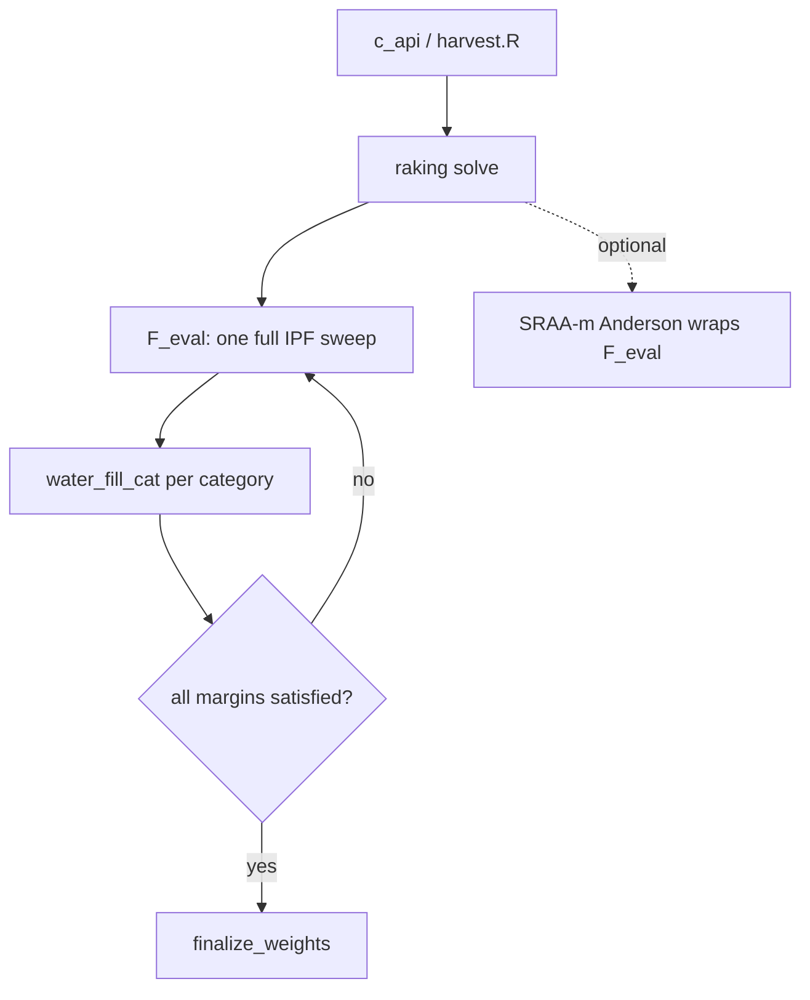

# RAKING — Bounded Cyclic IPF with Water-Filling Box Projection

> Enum: `RK_ALG_RAKING = 3`
> Source: `src/raking.cpp`, `src/raking.hpp`

## Overview

This is **classical cyclic iterative proportional fitting (raking) with hard per-cell box constraints enforced inside each margin step by a water-filling projection**. Unlike IEPPA (which clamps only at finalize) or Sinkhorn (which uses Dykstra correction vectors), RAKING enforces `L_c ≤ X[c] ≤ U_c` *inline*, by replacing each plain marginal rescale with a KL-projection onto the bounded simplex slice for that category.

The per-margin sweep function `F_eval` is **stateless** (no correction vectors carried between iterations), which is what allows it to be wrapped by SRAA-m Anderson acceleration.

## Mathematical formulation

### Objective

Bounded KL (I-divergence) calibration:

```
min_X   Σ_c X[c]·log(X[c]/X_init[c]) − X[c] + X_init[c]
s.t.    Σ_{c∈(k,j)} X[c] = T_kj   ∀ k,j
        L_c ≤ X[c] ≤ U_c          ∀ c
```

### Update rule — water-filling per category (`water_fill_cat`)

For each `(k,j)`, project the current category masses onto

```
{ X : Σ_{c∈(k,j)} X[c] = T_kj,  L_c ≤ X[c] ≤ U_c }
```

in KL geometry. The projection is the *single_adjust* scheme (autumn `rake.R`): find a single scaling `m` such that

```
Σ_c clamp(X_orig[c]·m, L_c, U_c) = T_kj
```

solved by repeatedly fixing cells that hit a bound and rescaling the free remainder until the active set stabilises. Margins are swept cyclically until all are satisfied.

## Architecture



- **Sweep**: `F_eval` lambda — one complete cyclic IPF pass; `water_fill_cat` does the bounded projection.
- **Statelessness**: no Dykstra vectors → `F_eval` is a pure fixed-point map → SRAA-m can accelerate it.
- **Scheduler**: greedy per-margin priority (disabled under SRAA-m, falls back to round-robin — logged).
- **Budget**: `inner_max_iter` is the iteration budget; `outer_max_iter` is unused.
- **Finalize**: shared `finalize_weights` (Σw=n then `bounds_mode`).

## Advantages

- **Hard bounds respected throughout iteration**, not just at the end — the iterate is always feasible w.r.t. the box, so an early stop still yields bounded weights.
- **Stateless sweep** → clean fit for Anderson acceleration.
- KL-optimal among bounded solutions (Csiszár–Tusnády geometry).
- Cheap iterations (no global linear solve).

## Drawbacks

- Water-filling adds an **inner loop** per category (active-set bisection), so iterations are heavier than plain IPF.
- First-order (linear) outer convergence like all IPF variants.
- Bound interaction across overlapping margins can slow the active-set settling.
- Greedy scheduler must be disabled under SRAA-m, losing a speed lever when acceleration is on.

## Mathematical guarantees and proofs

| Claim | Status | Basis |
|-------|--------|-------|
| Cyclic KL projections converge to the bounded KL minimum | **Strong** | Csiszár–Tusnády (1984) alternating I-projection theory; cited in source header (`raking.cpp`). Convergence holds when the constraint set is non-empty. |
| Each `water_fill_cat` is the exact KL projection onto one category's bounded slice | **Moderate→Strong** | The single-scaling water-fill is the KKT solution of the per-category KL projection; standard result, implemented faithfully but not re-proved in-repo. |
| Feasibility of every intermediate iterate | **Strong** | By construction `clamp(·,L,U)` keeps each cell in-box every step. |
| Global rate | **Weak** | No rate bound; depends on margin overlap and box activity. |

**Appraisal: Strong (for convergence), Moderate (for rate).** The bounded-KL convergence rests on a well-established projection theorem and the source cites it directly. What is *not* guaranteed in code is speed.

## Code references

| Component | File | Key symbols |
|-----------|------|-------------|
| Solve loop | `src/raking.cpp` | `F_eval`, sweep over margins |
| Bounded projection | `src/raking.cpp` | `water_fill_cat`, `bucket`, `clamped_sum` |
| Theory citation | `src/raking.cpp` | header comment (Csiszár 1975; Csiszár–Tusnády 1984) |
| Acceleration | `src/sraa.hpp` | SRAA-m |
| Finalize | `src/calib_dispatch.hpp` | `finalize_weights` |

---

## History & seminal sources

**1940 — Deming & Stephan.** The iterative proportional fitting (IPF) algorithm was introduced by Deming and Stephan [demingstephan1940] to adjust a sampled frequency table so that its marginal totals agree with known population expectations — originally applied to census frequency tables. The method cycles across margins, rescaling each in turn, until all constraints are satisfied. Convergence for unconstrained IPF on tables without zero cells is guaranteed; the Annals paper is the canonical reference for this property.

**1975 — Csiszár I-projection theory.** Csiszár [csiszar1975] established the geometric underpinning: each IPF marginal rescale step is an alternating I-projection (minimum KL divergence projection) onto the constraint hyperplane for one margin. This gives IPF its variational interpretation: the iterate sequence converges to the point of minimum KL divergence from the initial distribution subject to all marginal constraints simultaneously.

**1984 — Csiszár & Tusnády convergence.** Csiszár and Tusnády [csiszartusnady1984] proved convergence of cyclic alternating minimization under I-divergence for general closed convex constraint sets, directly covering the case of box-constrained margins. This is the theorem invoked in `raking.cpp`'s header comment to justify bounded-IPF convergence.

**1993 — Deville, Särndal & Sautory — generalized raking.** Deville, Särndal, and Sautory [devillesarndalsautory1993] unified IPF with calibration estimation under a common framework: minimize a convex distance function `G(w/d)` subject to exact margin constraints. They showed that classical raking (Deming–Stephan) is equivalent to exponential calibration (`G(r) = r log r − r + 1`) when auxiliary variables are categorical. They introduced the restricted (bounded) raking variant via the logit distance function, developed the CALMAR SAS macro, and proved that all generalized-raking estimators share the same asymptotic variance (the calibration estimator variance formula). Volume 88, No. 423 of JASA, pp. 1013–1020.

**Raking in R — Lumley (2004).** Lumley [lumley2004survey] implemented `survey::rake` (cyclic post-stratification calls) and `survey::calibrate` (Newton–Raphson on the normal equations of the KKT system) in the `survey` package, which became the reference implementation for design-based calibration in R.

---

## Practitioner implementations & use cases

Raking is the dominant weighting method in public opinion research, market research, and official statistics [battaglia2009tips; lumley2004survey].

**`survey::rake` (Lumley)** — CRAN package `survey` v4.5. Implements plain cyclic IPF via repeated calls to `postStratify`. Accepts `design` objects; supports arbitrary margin formulas. Does not natively enforce per-cell weight bounds inside the IPF loop (bounded calibration is available separately via `calibrate(..., calfun="logit", bounds=c(l,u))`). Convergence criterion: `epsilon` = max absolute change in table entries. Memory-intensive at scale: fails on medium-size datasets (~6,700 obs × 17 variables) due to internal dense table construction [aaronrudkin_autumn].

**`anesrake` (Pasek, v0.80)** — CRAN. Designed for the American National Election Studies workflow. Auto-selects variables exceeding a discrepancy threshold (`pctlim`), supports re-raking if previously-excluded variables fall out of bounds after weighting. Substantially slower and heavier than modern alternatives: benchmarks show `autumn` 11× faster at 108,000 obs × 17 variables, using 92% less memory [aaronrudkin_autumn].

**`autumn` (Rudkin, GitHub `aaronrudkin/autumn`)** — the `harvest()` function uses a `single_adjust` inner loop that is the direct algorithmic ancestor of leafblower's `water_fill_cat`. It caps weights at a maximum, redistributes excess to the free pool, and iterates until the mean-1 constraint is met. Default: `max_weight = 5`, `convergence$pct = 0.01`. Note: redistribution can push some weights *slightly above* the cap (post-redistribution overflow), a difference from leafblower's strict per-cell box clamp.

**`ipfr` (Ward & Macfarlane, v1.0.2)** — CRAN. Implements Iterative Proportional Updating (IPU) for two-level (household × person) seed tables. Primary use case is population synthesis and origin–destination matrix balancing. Supports `weight_floor` and `max_ratio`/`min_ratio` weight limits. Does not integrate with `survey` design objects.

**`regrake` (Timm)** — R-universe. Regularized raking via ADMM (Boyd et al. 2021 optimal representative sample weighting). Supports soft constraints (`rr_l2`, `rr_kl`) and quantile targets. Falls back to JAX-based `rswjax` for large problems. Suited to ill-posed or conflicting-margin scenarios where hard constraints would fail.

**Official statistics.** Statistical agencies (e.g., Statistics Canada, INSEE) use CALMAR/CALMAR2 (SAS) and similar tools implementing the Deville–Särndal framework [devillesarndalsautory1993]. Rim weighting (the market research name for raking) is used by firms such as Abt Global to balance consumer panels [battaglia2009tips].

---

## Known caveats & concerns (literature)

**Non-convergence under conflicting margins.** IPF convergence requires that the joint constraint set (intersection of all marginal hyperplanes) is non-empty. When population margins are drawn from inconsistent sources, no feasible point exists and the algorithm oscillates or diverges [lumley2004survey; battaglia2009tips].

**Empty cells.** Zero cells in the sample table break the multiplicative rescale: a zero cannot be lifted to a positive target. The standard analysis (Csiszár 1975) guarantees convergence only when the sample table is strictly positive. In practice, the algorithm either oscillates or gets stuck [lumleysurveypackage].

**Extreme weights — variance inflation.** Standard (unbounded) raking with the exponential distance function guarantees positive weights but not bounded ones. Rare demographic intersections receive arbitrarily large weights; a single high-weight unit can dominate estimates. The effective sample size loss is approximately `n / (1 + CV²(w))` where `CV(w)` is the weight coefficient of variation [battaglia2009tips]. Weight trimming reduces extreme weights at the cost of reintroducing bias (bias–variance trade-off).

**Tight bounds → infeasibility.** Bounded raking (logit calibration or water-filling) can fail to find a feasible point if the bounds are set tighter than the constraints allow. `survey::calibrate` with `calfun="logit"` will error; leafblower flags `is_infeasible = true` and commits best-effort values.

**Correlated margins slow convergence.** IPF convergence is linear (R-linear) in general; the spectral radius of the iteration operator depends on the inter-margin correlation. Highly correlated control variables significantly slow convergence [battaglia2009tips].

**Large category counts.** Each additional category multiplies the number of water-fill inner iterations. At scale (many variables × many categories), the per-sweep cost becomes dominated by the inner active-set bisection, not the outer IPF cycle.

**Variance estimation.** Calibrated weights affect the sampling variance. Linearisation-based variance estimation for calibration estimators uses the residuals `e_k = y_k − x_k^T B_hat` [devillesarndalsautory1993; lumley2004survey]. Ignoring the calibration step in variance estimation understates standard errors.

---

## How leafblower deviates (vs. common impl)

| Dimension | Common impl (`survey`, `autumn`, `anesrake`) | leafblower |
|-----------|---------------------------------------------|------------|
| **Bound enforcement** | Post-hoc trim or logit barrier (global) | Per-cell box clamp *inline* every margin step (`water_fill_cat`); every iterate is feasible |
| **Overflow after capping** | `autumn` redistributes excess → can exceed cap | Strict: free-pool rescale only touches unclamped cells; clamped cells stay exactly at bound |
| **Convergence guarantee** | Csiszár–Tusnády holds for unbounded; bounded case covered by [csiszartusnady1984] | Same theorem; leafblower enforces the closed convex box at every projection |
| **Newton–Raphson** | `survey::calibrate` uses global N-R on KKT system; can fail with singular Jacobian | None; pure cyclic projection — no matrix inversion, no singularity risk |
| **Acceleration** | Not offered (SRAA not in any CRAN package) | SRAA-m Anderson acceleration wraps `F_eval`; greedy scheduler as alternative |
| **Stateless sweep** | `survey::calibrate` carries Lagrange multipliers across; not directly acceleratable | `F_eval` is stateless (no Dykstra vectors) → enables SRAA-m |
| **SOR damping** | Not available | Optional SOR on margin updates when bounds are active |
| **Greedy scheduler** | Fixed round-robin in all CRAN implementations | Optional greedy priority by per-margin residual (disabled under SRAA-m) |
| **C++ throughput** | R-level loops in `survey::rake`; `autumn` pure R | C++17 with `-O3`; `inv_n_per_cell` precomputed; inner `water_fill_cat` avoids allocation |

**Better than common implementations when:**
- Hard per-cell bounds must be respected at every iteration (regulatory/disclosure constraints), not just at convergence.
- Anderson acceleration is required: the stateless sweep is a prerequisite.
- Throughput matters at high `n` or many categories: C++17 + precomputed reciprocals.
- Singular-Jacobian failure mode of Newton–Raphson must be avoided (sparse margins, tight bounds).

**Worse than or comparable to common implementations when:**
- A continuous auxiliary variable appears in the calibration model: `survey::calibrate` handles these directly via the GREG formulation; leafblower's IPF operates on categorical cell tables only.
- Variance estimation is needed: leafblower does not yet expose the calibration residuals required for correct linearisation-based SE estimation; `survey` does.
- Conflicting/soft margins are needed: `regrake` with ADMM handles infeasible constraints gracefully; leafblower flags infeasibility and exits with best-effort weights.
- Only two or three margins with no bounds: `survey::calibrate` Newton–Raphson converges in very few iterations; leafblower's IPF pays per-cycle overhead.

---

## References (`[key]` bullets)

- [demingstephan1940] Deming, W.E. & Stephan, F.F. (1940). "On a Least Squares Adjustment of a Sampled Frequency Table When the Expected Marginal Totals Are Known." *Annals of Mathematical Statistics* 11(4): 427–444. doi:10.1214/aoms/1177731829
- [csiszar1975] Csiszár, I. (1975). "I-Divergence Geometry of Probability Distributions and Minimization Problems." *Annals of Probability* 3(1): 146–158. doi:10.1214/aop/1176996454
- [csiszartusnady1984] Csiszár, I. & Tusnády, G. (1984). "Information Geometry and Alternating Minimization Procedures." *Statistics & Decisions*, Supplement Issue No. 1: 205–237.
- [devillesarndalsautory1993] Deville, J.-C., Särndal, C.-E. & Sautory, O. (1993). "Generalized Raking Procedures in Survey Sampling." *Journal of the American Statistical Association* 88(423): 1013–1020. doi:10.1080/01621459.1993.10476369
- [lumley2004survey] Lumley, T. (2004). "Analysis of Complex Survey Samples." *Journal of Statistical Software* 9(8): 1–19. doi:10.18637/jss.v009.i08
- [aaronrudkin_autumn] Rudkin, A. `autumn`: Fast, Modern, and Tidy-Friendly Iterative Raking in R. GitHub: https://github.com/aaronrudkin/autumn
- [battaglia2009tips] Battaglia, M.P., Izrael, D., Hoaglin, D.C. & Frankel, M.R. (2009). "Tips and Tricks for Raking Survey Data (a.k.a. Sample Balancing)." *Survey Practice* 2(5). https://www.researchgate.net/publication/228976550
- [lumleysurveypackage] Lumley, T. (2024). *survey*: Analysis of Complex Survey Samples. R package version 4.5. https://CRAN.R-project.org/package=survey
